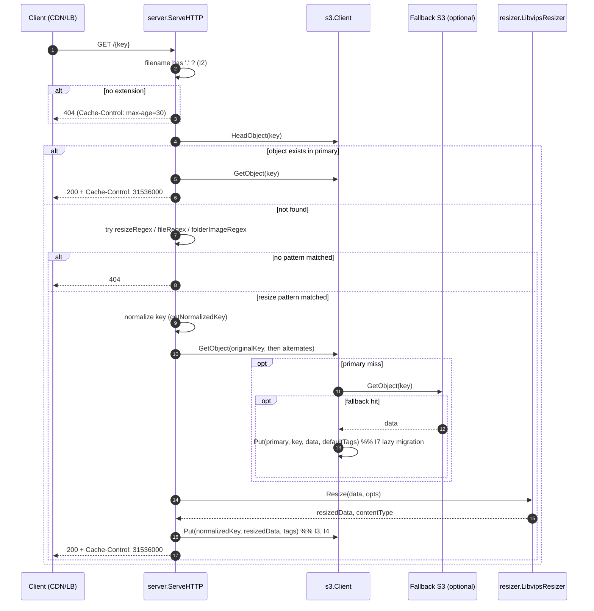
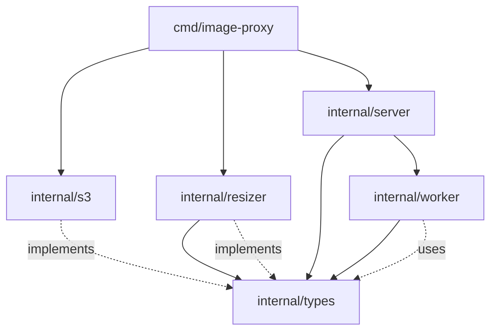

# Architecture: image-s3-proxy

> Graph-primary high-signal engineering reference. The codebase is tier-1 micro
> (5 modules, ~2200 LOC including tests). Every module was directly read; no
> sampling occurred. For token-optimized AI context, see `draft/.ai-context.md`.

---

## Table of Contents

1. [Executive Summary + Graph Health Dashboard](#1-executive-summary--graph-health-dashboard)
2. [Critical Invariants & Safety Rules](#2-critical-invariants--safety-rules)
3. [Primary Control & Data Flows](#3-primary-control--data-flows)
4. [Module & Dependency Map](#4-module--dependency-map)
5. [Concurrency, Ownership & Isolation Model](#5-concurrency-ownership--isolation-model)
6. [Error Handling & Failure Mode Catalog](#6-error-handling--failure-mode-catalog)
7. [State & Data Truth Sources + Reconciliation](#7-state--data-truth-sources--reconciliation)
8. [Extension Points & Safe Mutation Patterns](#8-extension-points--safe-mutation-patterns)
9. [Graph Coverage Gaps & Known Limitations](#9-graph-coverage-gaps--known-limitations)
10. [Relationship to Other Authoritative Documentation](#10-relationship-to-other-authoritative-documentation)

---

## 1. Executive Summary + Graph Health Dashboard

**What it is.** A single-binary Go HTTP server that serves resized e-commerce
product images. It is an on-demand transformation proxy in front of S3-compatible
object storage. Resized variants are cached back to the same bucket so repeat
requests hit S3 directly without ever touching libvips. A bulk pre-resize worker
is mounted at `POST /_/worker/trigger` for warming caches.

**Why it exists.** Replaces a Node.js implementation. Mirrors that prior service's
URL conventions and resize semantics so existing webshop frontends keep working
without coordinated client changes. Runs in production behind a load balancer.

**Shape.**

- 1 entry point: `cmd/image-proxy/main.go` (107 LOC) — env-var bootstrap.
- 4 internal packages: `s3` (storage), `resizer` (libvips wrapper), `server`
  (HTTP + URL routing), `worker` (bulk resize / event handler), `types`
  (interfaces only).
- 1 binary, deployed as Alpine or Debian Docker image (CGO required for libvips).
- ~600 LOC of production code + ~1400 LOC of tests with mock interfaces.

### Graph Health Dashboard

| Dimension                | Status                                       | Source              |
|--------------------------|----------------------------------------------|---------------------|
| Graph engine             | Not run (binary not present in environment)  | env probe           |
| Module enumeration       | Complete (5/5 read directly)                 | direct file read    |
| Public surface coverage  | Complete (HTTP routes, types interfaces)     | `server.go`, `types.go` |
| Hotspot identification   | `internal/server/server.go` (358 LOC, fan-in 4) | `wc -l` + import graph |
| Dependency edges         | Complete                                     | Go imports          |
| Test fidelity            | High — every prod package has `_test.go`     | `find` |
| External I/O surface     | S3 GET/HEAD/PUT, libvips in-process          | `s3.go`, `resizer.go` |
| Concurrency model        | Single goroutine per request + 1 fire-and-forget worker goroutine | `server.go:293` |
| Configuration surface    | 14 env vars (catalogued §7)                  | `main.go`           |

---

## 2. Critical Invariants & Safety Rules

Invariants the code currently enforces. Violating any of these will break
production traffic or corrupt the cache. Each carries a provenance tag.

| # | Rule | Provenance | Notes |
|---|------|------------|-------|
| I1 | `BUCKET` env var **must** be set; absence is a fatal startup error | [Code:main.go:23-25] | Hard fail by design. |
| I2 | Filename portion of every request key **must** contain a `.`; keys without an extension return 404 immediately | [Code:server.go:52-61] | Cheap guard against bot/path scanners. |
| I3 | Resized output is **always** cached back to S3 under the exact requested key (`s.s3Client.Put(ctx, key, ...)`) before being returned to the client | [Code:server.go:236, server.go:269] | Means the bucket is the cache; there is no in-process cache layer. |
| I4 | The cache key written to S3 is the **normalized** key produced by `getNormalizedKey`, not the raw request path. The raw path will redirect through the resize pipeline on every request if normalization differs | [Code:server.go:85-90,101-104] | Subtle: clients that bypass normalization pay the resize cost every time. |
| I5 | `Cache-Control: max-age=31536000` is sent on all 2xx image responses; `max-age=30` is sent on errors | [Code:server.go:75,111,243,275,248] | Edge/CDN behavior depends on this contract. |
| I6 | Fallback S3 lookups try the **original key first**, then the key with the leading `<clientId>/` prefix stripped | [Code:s3.go:88-95,118-122] | Migration shim from a bucket that stored a different prefix layout. |
| I7 | When `Get` succeeds against the fallback bucket, the object is **copied to the primary bucket** with `defaultTags` before being returned | [Code:s3.go:127-130] | Lazy migration. A failed `Put` here is logged but not propagated. |
| I8 | `vips.Startup` is called exactly once at process start; `vips.Shutdown` exactly once at exit via `defer` | [Code:main.go:98-99, resizer.go:29,33] | libvips global state — duplicate startup or missed shutdown causes leaks. |
| I9 | `vips.ImageRef` instances **must** be `Close()`'d. The resizer uses `defer image.Close()` immediately after load | [Code:resizer.go:52] | Failure to close leaks native memory. |
| I10 | The `POST /_/worker/trigger` endpoint dispatches work in a **detached goroutine** with `context.Background()`; the HTTP response returns 202 immediately and never reflects the outcome of the resize | [Code:server.go:293-298] | Fire-and-forget. No retries, no result channel, no observability beyond logs. |
| I11 | Worker `ProcessProductImage` **skips** thumbnails that already exist in the primary bucket unless `forceOverwrite` is true; `forceOverwrite` is hard-coded `false` when constructed by the server | [Code:worker.go:80-86, server.go:36] | Idempotent by default. |
| I12 | Tag values are URL-query-escaped when sent as the S3 `Tagging` header | [Code:s3.go:158-162] | Necessary for any tag value containing `&` or `=`. |

**Safety rules (don't do):**

- **Do not** add an in-process LRU/byte cache layer on top of S3 without first
  reconsidering I3 — the bucket *is* the cache, and S3 lifecycle/tagging is
  expected to manage it.
- **Do not** call `vips.Startup` from anywhere other than `LibvipsResizer.Startup`.
- **Do not** call `s3Client.Put` in a hot path without thinking about the cost
  of an unbounded `Put` per request when normalization or pattern matching
  changes — this can multiply S3 write costs.

---

## 3. Primary Control & Data Flows

### 3.1 Request lifecycle (the hot path)



### 3.2 URL → key normalization

There are three URL families. Each maps a public URL to an **original key** (the
source image to fetch) and a **normalized key** (where the resized output is
cached). Names below come from the named capture groups in `server.go:17-21`.

| Regex | Matches | Example public URL | Original key | Normalized cache key |
|-------|---------|--------------------|--------------|----------------------|
| `resizeRegex` | resize products/blocks/branding | `/13/2/images/products/240/336/foo.jpg` | `13/catalog/products/images/foo.jpg` | `13/2/images/products/240/336/foo.jpg` |
| `fileRegex` | passthrough files | `/13/files/42/doc.pdf` | `13/files/42/doc.pdf` | (same — no transform) |
| `folderImageRegex` | format-change / passthrough | `/13/images/branding/logo.webp` | `13/catalog/branding/images/logo.webp` | `13/0/images/branding/logo.webp` |

Key facts:

- A `version` URL segment that defaults to `1` for `resizeRegex` and `0` for
  `folderImageRegex` controls the `Fit` strategy (cover for v1, contain for
  v2/v3). See `server.go:135-176`.
- A trailing format extension is **always** the last `.`-suffix. Compound
  extensions like `foo.png.webp` strip the original extension (`server.go:147-151`).
- The resize path tries multiple candidate keys (up to ~14: original key, with
  format suffix, alt prefix, with common extensions) before giving up. This is a
  resilience feature, not a correctness feature.

### 3.3 Worker pre-resize flow

```mermaid
flowchart LR
    A[POST /_/worker/trigger<br/>{key}] --> B[server.handleWorkerTrigger]
    B -->|go fn| C[worker.ProcessS3Event]
    C -->|key matches 'catalog/products/images/' or 'originals/'| D[ProcessProductImage]
    D --> E[s3Client.Get original]
    E --> F[for each size in DefaultSizes/SIZES]
    F --> G{exists & !forceOverwrite?}
    G -- yes --> F
    G -- no --> H[resizer.Resize]
    H --> I[s3Client.Put thumbKey]
    I --> F
```

Notes:

- The worker hard-codes `clientId=13` in the thumbnail key path
  (`worker.go:78`). This is a known limitation — see §9.
- The HTTP layer returns `202 Accepted` immediately and never surfaces the
  outcome of the goroutine.

---

## 4. Module & Dependency Map

### 4.1 Module inventory

| Module | Path | LOC | Tests | Role |
|--------|------|-----|-------|------|
| `main` | `cmd/image-proxy/main.go` | 107 | — | env-var bootstrap, wiring, lifecycle |
| `types` | `internal/types/types.go` | 29 | — | interface definitions only |
| `s3` | `internal/s3/s3.go` | 173 | 216 | AWS SDK v2 client with optional fallback bucket |
| `resizer` | `internal/resizer/resizer.go` | 157 | 153 | libvips wrapper |
| `server` | `internal/server/server.go` | 358 | 705 | HTTP routing, regex matching, resize orchestration |
| `worker` | `internal/worker/worker.go` | 112 | 181 | bulk pre-resize / S3-event handler |

### 4.2 Dependency edges (Go imports, production code only)



Key observations:

- `types` is the **only** internal-internal dependency. All other internals
  depend on `types` for interface contracts; they do not import each other.
- `main` does the wiring. There is no DI container — constructor injection is
  explicit.
- `server` constructs its own `worker` (`server.go:36`), passing
  `forceOverwrite=false` and `nil` for the destination client. The worker has
  no constructor-time access to a separate destination bucket; that's a code
  path reserved for direct (non-server) instantiation.
- No cycles. The graph is a DAG rooted at `main`.

### 4.3 Public surface

- **HTTP routes** (registered implicitly via `ServeHTTP`):
  - `POST /_/worker/trigger` — JSON `{"key": "..."}` → 202 Accepted.
  - `GET /{any}` — image fetch + optional resize. Three URL families described in §3.2.
- **Go interfaces** in `internal/types/types.go`:
  - `Resizer` — `Resize([]byte, ImageOptions) ([]byte, string, error)`
  - `S3Client` — `Exists`, `Get`, `Put` (context-aware)
  - `Storage` — non-context variant; **declared but unused** as of this snapshot.

---

## 5. Concurrency, Ownership & Isolation Model

- **HTTP server**: one goroutine per request (stdlib `net/http` default). No
  custom worker pool, no rate limiting, no semaphores.
- **libvips**: configured at startup with `VIPS_CONCURRENCY` (0 = libvips
  default → number of cores). libvips itself is thread-safe between
  `Startup` and `Shutdown`. Each request constructs a fresh `vips.ImageRef`
  and closes it via `defer` (`resizer.go:52`).
- **Fire-and-forget goroutine**: `server.handleWorkerTrigger` launches a single
  detached goroutine per trigger call (`server.go:293-298`). It uses
  `context.Background()` — the originating HTTP request's cancellation does
  **not** propagate.
- **Shared mutable state**: none in production code. The S3 client mutates
  `defaultTags` and `fallbackClient` only during startup
  (`SetDefaultTags`, `SetFallback`); after `main` returns from setup, both are
  read-only.
- **No locks**. No `sync.Mutex`, no `sync.RWMutex`, no channels in production
  code. Concurrency safety relies on the stdlib SDK being safe and on no
  post-startup mutation of `s3.Client` fields.

**Failure surface from concurrency:** the only contended resource is libvips's
internal cache (governed by `VIPS_MAX_CACHE_MEM` and `VIPS_MAX_CACHE_SIZE`).
Under sustained load, memory pressure manifests in libvips, not in Go.

---

## 6. Error Handling & Failure Mode Catalog

| Failure | Where | Detection | Reaction |
|---------|-------|-----------|----------|
| Missing required env (`BUCKET`) | `main.go:23-25` | startup | `log.Fatal` — process exits |
| `SIZES` env malformed JSON | `main.go:58-62` | startup | log warning, use `DefaultSizes` |
| S3 client init failure | `main.go:71-73` | startup | `log.Fatal` |
| Fallback S3 client init failure | `main.go:89-94` | startup | log warning, primary continues without fallback |
| Request path has no `.` | `server.go:57-61` | per-request | 404 |
| `Exists` returns error (not NotFound) | `server.go:64-67` | per-request | logged, treated as "doesn't exist", falls through to resize attempt |
| Get succeeds in primary | `server.go:72-78` | per-request | serve bytes |
| Get fails after `Exists` reported true | `server.go:73-79` | per-request | logged, falls through |
| Original not found across all candidate keys | `server.go:221-225` | per-request | 404, `Cache-Control: max-age=30` |
| Resize error | `server.go:229-232` | per-request | 500 |
| S3 Put (cache-back) error | `server.go:236-239` | per-request | logged; client still receives the bytes |
| Worker resize error | `worker.go:73-76` | per-size | logged, continues with next size |
| Worker Put error | `worker.go:94-97` | per-size | logged, continues with next size |
| `ProcessS3Event` with unrecognized key | `worker.go:107-110` | per-event | logged, no error returned |

**Error-handling philosophy** inferred from code:

- Errors at the **edge** (env, S3 init) are fatal.
- Errors **during request handling** that are recoverable (Put-back failure)
  are logged but do not fail the request, because the client doesn't care
  whether we cached the result.
- Errors that prevent a useful response (resize, complete S3 read failure) are
  returned with cache-control hinting the CDN to retry quickly.
- The worker explicitly **continues on per-size failure** so one bad size
  doesn't abort the whole pre-resize batch.

---

## 7. State & Data Truth Sources + Reconciliation

### 7.1 Truth sources

| Source | Owns | Read by | Written by |
|--------|------|---------|------------|
| Primary S3 bucket (`BUCKET`) | All cached images (originals + resized) | `s3.Client.Get`, `s3.Client.Exists` | `s3.Client.Put` |
| Fallback S3 bucket (`OLD_S3_BUCKET`, optional) | Legacy originals during migration | `s3.Client.Get` (fallback path) | never written to |
| Environment variables (process env) | All configuration | `main.go` at startup only | n/a (no hot reload) |
| libvips global config | Cache, concurrency | `vips.Startup` once | once at startup |

### 7.2 Configuration surface

All configuration is process-env, evaluated once in `main.go`:

| Env var | Default | Critical? | Purpose |
|---------|---------|-----------|---------|
| `BUCKET` | — | Y (fatal if missing) | Primary S3 bucket name |
| `AWS_REGION` / `AWS_DEFAULT_REGION` | `us-east-1` | N | Region for primary client |
| `AWS_ACCESS_KEY_ID` / `AWS_SECRET_ACCESS_KEY` | — | N | Static creds; if absent, default chain |
| `S3_ENDPOINT` | — | N | Custom endpoint (Hetzner / MinIO) |
| `PORT` | `8080` | N | HTTP listen port |
| `DEBUG` | `false` | N | Enable libvips logging |
| `IMAGE_TAGS` | — | N | Comma-separated `k=v,k=v` → `defaultTags` on Put |
| `SIZES` | `DefaultSizes` (33 entries, `worker.go:22-27`) | N (worker only) | JSON `[[w,h], ...]` for pre-resize batch |
| `FORMAT` | `avif` | N (worker only) | Target format for pre-resize batch |
| `VIPS_CONCURRENCY` | libvips default (cores) | N | libvips global concurrency |
| `VIPS_MAX_CACHE_MEM` | libvips default | N | libvips cache memory cap |
| `VIPS_MAX_CACHE_SIZE` | libvips default | N | libvips cache entry cap |
| `OLD_S3_BUCKET` | — | N (enables fallback) | Legacy bucket for fallback Get |
| `OLD_S3_REGION` / `OLD_S3_ACCESS_KEY_ID` / `OLD_S3_SECRET_ACCESS_KEY` / `OLD_S3_ENDPOINT` | inherited / empty | N | Fallback client config |

### 7.3 Reconciliation between primary and fallback

The only cross-bucket reconciliation is the **lazy migration** in `s3.Client.Get`
(I7). It is one-way: fallback → primary. Tag set is `defaultTags`. There is no
batch migration command, no consistency check, no TTL on fallback lookups —
if a key is repeatedly requested and the fallback is slow, every request takes
the fallback path until it's been migrated.

---

## 8. Extension Points & Safe Mutation Patterns

### 8.1 Adding a new URL pattern

1. Add a new `regexp.MustCompile` at the top of `server.go` (alongside
   `resizeRegex`, `fileRegex`, `folderImageRegex`).
2. Add a matched branch in `ServeHTTP` between the existing pattern checks and
   the final 404.
3. Add a handler method (`handleX(w, ctx, key, groups)`) that computes the
   original key, fetches, transforms, and caches. Follow the pattern of
   `handleResize` and `handleFile`.
4. If the pattern changes the cache key, update `getNormalizedKey` to know about
   the new `regexType`.
5. Add tests against `server_test.go` using the existing `mockS3Client`/
   `mockResizer` helpers.

### 8.2 Adding a new output format

1. Add a `case` to the `switch strings.ToLower(opts.Format)` in
   `resizer.go:123-150`. Use the matching `vips.NewXxxExportParams()` and
   `image.ExportXxx`.
2. Set the matching `contentType`.
3. The default fallback at `resizer.go:143-149` is JPEG — leave that.

### 8.3 Adding a new S3 backend interface method

1. Add it to the `S3Client` interface in `internal/types/types.go`.
2. Implement it on `s3.Client`.
3. Decide fallback semantics — by convention, methods that read consult the
   fallback bucket; methods that write **do not**.
4. Update `mockS3Client` in any `_test.go` that constructs one.

### 8.4 Adding a new env-var config knob

1. Read it in `main.go` near the other env reads (group with related vars).
2. Document it in `README.md` and in §7.2 of this doc.
3. Pass it explicitly through constructors — do **not** introduce a global
   config struct unless the env surface grows beyond ~20 entries.

### 8.5 Patterns that look like extension points but aren't

- The `Storage` interface in `types.go` is declared but unused. Don't take a
  dependency on it without first removing or wiring it.
- The `worker.destS3Client` field is supported by the worker constructor but
  always passed `nil` from the server. It is currently dead code in the
  hot path. Either wire it from the server with new env vars or delete it.
- `worker.go:78` hard-codes `clientId=13` in the thumb key — this is **not**
  intentional flexibility, it is a known bug (§9).

---

## 9. Graph Coverage Gaps & Known Limitations

The graph engine was not available in this environment, so structural ground
truth came from direct file reads. This is acceptable at tier-1 micro scale
(5 modules), but the following gaps and known limitations are explicitly called
out:

1. **No deterministic call-graph or fan-in/fan-out counts.** Fan-in claims in
   §4 ("server.go fan-in 4") are derived by inspection, not a tool. If a future
   refactor changes import edges, this doc must be re-synced manually.

2. **Hard-coded clientId in `worker.go:78`.** The worker constructs
   thumbnail keys with `"13/%d/images/..."`. This means the worker is only
   correct for clientId `13`. This is documented here as a known limitation;
   it is **not** a synthesis artifact.

3. **`types.Storage` interface is declared but unused.** Either it's vestigial
   or it indicates an aborted refactor. The code does not tell us which.

4. **`worker.destS3Client` field is supported but never wired.** See §8.5.

5. **No metrics, no tracing, no structured logging.** The service uses
   `log.Printf` exclusively. Any observability beyond stdout requires
   instrumentation. This is a deliberate design choice for a small service,
   not a synthesis gap, but it is worth knowing before making changes.

6. **Fallback bucket has no automatic backfill.** Lazy migration (I7) is
   per-request only. There is no batch migration job.

7. **The `POST /_/worker/trigger` endpoint has no auth.** Any caller that can
   reach the listener can dispatch worker jobs. This is acceptable only because
   the listener is expected to be behind a load balancer that handles
   authentication / IP allowlisting.

8. **`Exists` errors are silently treated as "not exists"** in `server.go:65-67`.
   If the S3 service is degraded (5xx on HEAD), the proxy will fall through
   to the resize path and likely fail again on `Get`, returning a generic
   "Original not found" 404. This may mask real S3 outages from the CDN.

---

## 10. Relationship to Other Authoritative Documentation

Context Audit at init time: **Low**. The only pre-existing documents were:

- `README.md` — user-facing operational doc (env vars, Makefile targets, run instructions).
- `junie.md` — generic Go-coding best-practices template, not specific to this codebase.
- `.junie/memory/*` — Junie agent memory files (errors.md, feedback.md, tasks.md, language.json) — operational session state, not architectural reference.

This architecture.md does not duplicate the README's operational content. It
adds:

- The structural module map and dependency DAG.
- The URL-routing semantics and key-normalization rules (not visible from env vars alone).
- The complete invariant list with code provenance.
- The error-handling catalog.
- The known limitations and migration shims that are only obvious from reading code.

If a future contributor maintains both, the README is authoritative for **how
to run** and this doc is authoritative for **how it works internally**.
`junie.md` should be treated as a generic style guide; project-specific
conventions live in `draft/guardrails.md`.
