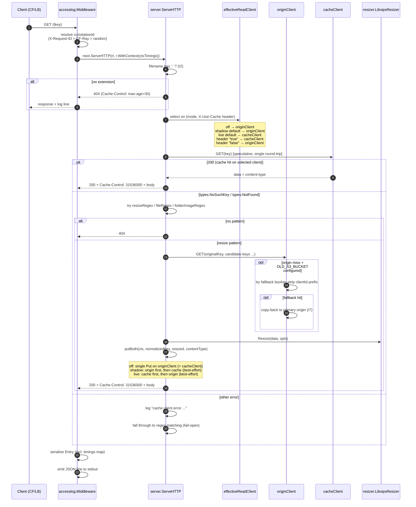
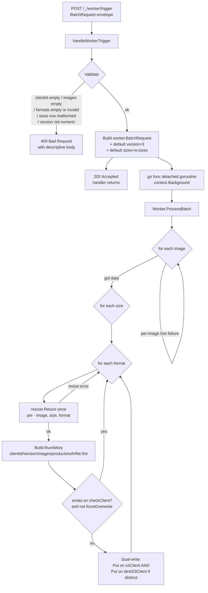
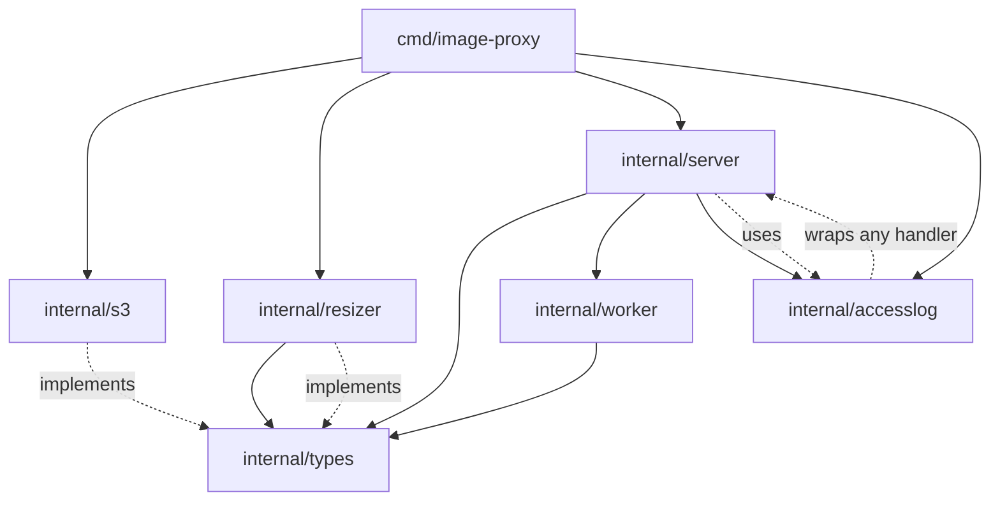

# Architecture: image-s3-proxy

> Graph-primary high-signal engineering reference. The codebase is tier-1 micro
> (6 modules, ~5200 LOC including tests). Every module was directly read; no
> sampling occurred. For token-optimized AI context, see `draft/.ai-context.md`.

---

## Table of Contents

1. [Executive Summary + Graph Health Dashboard](#1-executive-summary--graph-health-dashboard)
2. [Critical Invariants & Safety Rules](#2-critical-invariants--safety-rules)
3. [Primary Control & Data Flows](#3-primary-control--data-flows)
4. [Module & Dependency Map](#4-module--dependency-map)
5. [Concurrency, Ownership & Isolation Model](#5-concurrency-ownership--isolation-model)
6. [Error Handling & Failure Mode Catalog](#6-error-handling--failure-mode-catalog)
7. [State & Data Truth Sources + Reconciliation](#7-state--data-truth-sources--reconciliation)
8. [Extension Points & Safe Mutation Patterns](#8-extension-points--safe-mutation-patterns)
9. [Graph Coverage Gaps & Known Limitations](#9-graph-coverage-gaps--known-limitations)
10. [Relationship to Other Authoritative Documentation](#10-relationship-to-other-authoritative-documentation)

---

## 1. Executive Summary + Graph Health Dashboard

**What it is.** A single-binary Go HTTP server that serves resized e-commerce
product images. It is an on-demand transformation proxy in front of S3-compatible
object storage. Resized variants are cached back to S3 so repeat requests hit
storage directly without ever touching libvips. A bulk pre-resize endpoint at
`POST /_/worker/trigger` accepts a multi-image / multi-format envelope for
warming caches.

**Why it exists.** Replaces a Node.js implementation. Mirrors that prior service's
URL conventions and resize semantics so existing webshop frontends keep working
without coordinated client changes. Runs in production behind Cloudflare on
Hetzner dedicated servers under k3s.

**What changed since init (2026-06-12).** Four PRs merged in sequence:

- **PR #1** — Structured JSON access logs to stdout + per-phase `Server-Timing`
  response header. Introduced `internal/accesslog` package (5 production files,
  middleware wrapper, per-request `*Timings` accumulator threaded via context).
- **PR #2** — Split-bucket canary topology. `CacheMode` enum (`off|shadow|live`)
  with `X-Use-Cache` per-request header override. Removed `S3 Tagging` from
  PutObject calls (HOS doesn't implement it, R2 rejects it). Replaced
  HEAD-then-conditional-GET cache-hit path with a single speculative GET that
  uses AWS SDK v2 typed-error classification.
- **PR #3** — Per-phase `timings` field on the JSON access log entries (same
  data as `Server-Timing`, in seconds-3-decimal instead of ms).
- **PR #4** — Worker trigger payload became a multi-image / multi-format
  envelope. Closed the hardcoded `clientId=13` limitation. Removed
  `ProcessProductImage` + `ProcessS3Event` (legacy single-key path).

**Shape (after refresh).**

- 1 entry point: `cmd/image-proxy/main.go` (157 LOC) — env-var bootstrap, mode
  validation, two-client wiring, accesslog middleware wrap.
- 6 internal packages:
  - `types` (35 LOC) — `S3Client` + `Resizer` interfaces + `ImageOptions`.
  - `s3` (182 LOC) — AWS SDK v2 client; optional origin-side fallback for
    legacy-bucket migration; typed-error classification with string fallback
    for HOS-style providers that don't surface typed errors directly.
  - `resizer` (157 LOC) — libvips (govips) wrapper. Format dispatch
    (png|webp|avif|jpg).
  - `server` (619 LOC) — HTTP routing (3 URL regex families + worker
    trigger), `CacheMode` dispatch, `effectiveReadClient` selection,
    `putBoth` dual-write helper, `s.time` phase-timer wrapper.
  - `worker` (157 LOC) — `ProcessBatch` cartesian fan-out (images × sizes
    × formats), with per-image and per-output failure isolation.
  - `accesslog` (487 LOC across 5 files) — `Middleware` wrapper that emits
    a structured JSON log line per request + `Server-Timing` response
    header. `Timings` accumulator (mutex-guarded); `Logger` (typed Entry
    + JSON Marshal); `responseRecorder` (status + bytes capture + first-
    WriteHeader timing-header injection); context plumbing.
- 1 binary, deployed as Alpine or Debian Docker image (CGO required for libvips).

### Graph Health Dashboard

| Dimension                | Status                                       | Source              |
|--------------------------|----------------------------------------------|---------------------|
| Graph engine             | Not run (binary not present in environment)  | env probe           |
| Module enumeration       | Complete (6/6 read directly)                 | direct file read    |
| Public surface coverage  | Complete (HTTP routes, types interfaces, accesslog API) | direct read |
| Hotspot identification   | `internal/server/server.go` (619 LOC, fan-in 4) | `wc -l` + import graph |
| Dependency edges         | Complete                                     | Go imports          |
| Test fidelity            | High — every prod package has `_test.go` (server: 1584 LOC of tests) | `find` |
| External I/O surface     | S3 GET/HEAD/PUT against origin + optional cache + optional fallback; libvips in-process; stdout JSON logs | `s3.go`, `resizer.go`, `accesslog/log.go` |
| Concurrency model        | Goroutine-per-request (stdlib net/http) + 1 fire-and-forget worker goroutine per `POST /_/worker/trigger`; per-request `*Timings` is mutex-guarded | `server.go`, `accesslog/timings.go` |
| Configuration surface    | 22 env vars (catalogued §7) — grew by 6 (`CACHE_MODE`, `CACHE_BUCKET`, `CACHE_S3_ENDPOINT`, `CACHE_AWS_*`) | `main.go` |

---

## 2. Critical Invariants & Safety Rules

Invariants the code currently enforces. Violating any of these will break
production traffic, corrupt the cache, or break the access-log shape that
monitoring depends on. Each carries a provenance tag.

| # | Rule | Provenance | Notes |
|---|------|------------|-------|
| I1 | `BUCKET` env var **must** be set; absence is a fatal startup error | [Code:main.go:21-23] | Hard fail by design. |
| I2 | Filename portion of every request key **must** contain a `.`; keys without an extension return 404 immediately | [Code:server.go:0-extension-check] | Cheap guard against bot/path scanners. |
| I3 | Cache-back PUT is always attempted before serving the body on resize / file paths. With `CACHE_MODE=off`, a single Put against the origin client; with `shadow`/`live`, a dual-write to BOTH origin and cache via `putBoth` | [Code:server.go:putBoth, handleResize, handleFile] | The bucket(s) **are** the cache; no in-process cache layer. |
| I4 | The cache key written to S3 is the **normalized** key produced by `getNormalizedKey`, not the raw request path | [Code:server.go:getNormalizedKey] | Subtle: clients that bypass normalization pay the resize cost every time. |
| I5 | `Cache-Control: max-age=31536000` is sent on all 2xx image responses; `max-age=30` is sent on errors via `httpError` | [Code:server.go:Cache-Control headers] | Edge/CDN behavior depends on this contract. |
| I6 | When `OLD_S3_BUCKET` is configured: origin-side fallback Get retries with original key first, then key with leading `<clientId>/` prefix stripped | [Code:s3.go:Get fallback] | Migration shim from a legacy bucket prefix layout. Origin-client only — the cache client never has a fallback. |
| I7 | When the fallback Get succeeds, the object is copied to the primary origin bucket (lazy migration). Failed copy-back is logged, not propagated | [Code:s3.go:Get copy-back] | One-way fallback → primary origin. The cache client is never involved. |
| I8 | `vips.Startup` is called exactly once at process start; `vips.Shutdown` exactly once at exit via `defer` | [Code:main.go:128-130, resizer.go] | libvips global state — duplicate startup or missed shutdown causes leaks. |
| I9 | `vips.ImageRef` instances **must** be `Close()`'d. The resizer uses `defer image.Close()` immediately after load | [Code:resizer.go] | Failure to close leaks native memory. |
| I10 | `POST /_/worker/trigger` validates the request envelope **synchronously**, then dispatches work in a **detached goroutine** with `context.Background()`. The 202 Accepted is written before the goroutine starts and never reflects per-image outcomes | [Code:server.go:handleWorkerTrigger] | Fire-and-forget. No retries, no result channel, no observability beyond stdout logs. |
| I11 | Worker `ProcessBatch` skips a per-output thumbnail when it already exists in the **cache client** (when split mode) or the **single client** (when off mode), unless `forceOverwrite` is true. `forceOverwrite` is hardcoded `false` at `server.NewServer` / `NewServerWithMode` construction | [Code:worker.go:processOutput exists-check, server.go:NewServerWithMode] | Pre-warm idempotency. The exists-check is intentionally against the *write* target, not the origin. |
| I12 | The access-log JSON entry always contains a top-level `timings` key. The key is present even on requests that record no phases (e.g. POST `/_/worker/trigger`, which emits `"timings": {}`) | [Code:accesslog/middleware.go, accesslog/log.go] | Monitoring queries that test for field presence depend on this. |
| I13 | `upstream.responseTime` in the access log equals the sum of values in `timings` within float epsilon — both go through the same `round3` helper | [Code:accesslog/middleware.go:round3] | Sum-equals-parts invariant. Documented in the access-log spec. |
| I14 | `s3.Client.Put` no longer accepts a `tags` parameter; no `PutObjectInput.Tagging` field is set anywhere in the codebase. `IMAGE_TAGS` env at startup → single deprecation warning, then discarded | [Code:s3.go:Put, main.go:IMAGE_TAGS] | Neither HOS nor R2 implements S3 Tagging APIs; the prior tagging behavior was silently dropped on HOS and would hard-fail on R2. |
| I15 | When `CACHE_MODE != off` and `CACHE_BUCKET` is unset: startup is fatal with a clear error naming both env vars. When `CACHE_MODE = off` and `CACHE_BUCKET` is set: startup logs a "set-but-ignored" warning and proceeds | [Code:main.go:CACHE_MODE validation] | Defensive config validation. |
| I16 | The `X-Use-Cache` request header is honored only when `CACHE_MODE != off`. Values `"true"` / `"false"` override the default read source for one request; any other value is ignored silently. Writes are unaffected by the header — dual-write semantics depend only on `CACHE_MODE` | [Code:server.go:effectiveReadClient] | Per-request override for synthetic monitors. |
| I17 | Cache-hit speculative GET: the AWS SDK v2 typed errors `*types.NoSuchKey` / `*types.NotFound` are classified as clean miss (fall through to regex matching with no log line). Any other error logs `cache client error for ...` and **still** falls through (fail-open, matching pre-track behavior, just no longer silently misclassified) | [Code:server.go:ServeHTTP, isNotFoundErr helper] | Fixes the silent-error fall-through originally flagged at init time. |

**Safety rules (don't do):**

- **Do not** add an in-process LRU/byte cache layer on top of S3. The
  bucket(s) **are** the cache (I3). Adding one breaks lifecycle/cost
  assumptions and creates a cache-coherency problem on the put-back path.
- **Do not** call `vips.Startup` from anywhere other than
  `LibvipsResizer.Startup`.
- **Do not** reintroduce S3 Tagging on PutObject (I14). It silently no-ops
  on HOS and hard-fails on R2.
- **Do not** wire the cache client to consult a fallback bucket. The cache
  is best-effort; a miss falls through to the regex/resize path naturally.
- **Do not** add per-output retry inside `ProcessBatch` without first
  considering the existing skip-existing check (I11) — re-running the
  batch is the retry mechanism.
- **Do not** write to `cmd/image-proxy/main.go`'s `os.Getenv` pattern from
  any internal package — `main.go` is the only env-reader by convention.

---

## 3. Primary Control & Data Flows

### 3.1 Request lifecycle (the hot path, after PR #2 single-GET refactor)



Server-Timing response header is set on the first `WriteHeader` from the
phases recorded up to that point. Phases added after `Write` are still
captured in the access log line but cannot appear in the header (it's
already on the wire).

### 3.2 URL → key normalization

There are three URL families. Each maps a public URL to an **original key**
(the source image to fetch from `originClient`) and a **normalized key**
(where the resized output is cached on `cacheClient`). Names below come from
the named capture groups in `server.go`.

| Regex | Matches | Example public URL | Original key | Normalized cache key |
|-------|---------|--------------------|--------------|----------------------|
| `resizeRegex` | resize products/blocks/branding | `/13/2/images/products/240/336/foo.jpg` | `13/catalog/products/images/foo.jpg` | `13/2/images/products/240/336/foo.jpg` |
| `fileRegex` | passthrough files | `/13/files/42/doc.pdf` | `13/files/42/doc.pdf` | (same — no transform) |
| `folderImageRegex` | format-change / passthrough | `/13/images/branding/logo.webp` | `13/catalog/branding/images/logo.webp` | `13/0/images/branding/logo.webp` |

Key facts (unchanged since init):

- A `version` URL segment that defaults to `1` for `resizeRegex` and `0` for
  `folderImageRegex` controls the `Fit` strategy (cover for v1, contain for
  v2/v3).
- A trailing format extension is **always** the last `.`-suffix. Compound
  extensions like `foo.png.webp` strip the original extension.
- The resize path tries multiple candidate keys (up to ~14) before giving up.

### 3.3 Worker pre-resize flow (PR #4: BatchRequest envelope)



Notes:

- The handler-side **validation is synchronous** before the 202 (I10). Any
  validation failure → 400 with a body that names the failing field.
- Inside `ProcessBatch`, **per-image** Get failure is isolated (skip image,
  continue), and **per-output** Resize failure is isolated (skip output,
  continue). The batch never returns an error to the caller (it's
  fire-and-forget anyway, but the contract is documented).
- The `clientId=13` hardcode is gone (PR #4). Output keys begin with
  `req.ClientID` from the payload.

### 3.4 Access-log emission

Per-request lifecycle inside `accesslog.Middleware`:

```mermaid
sequenceDiagram
    participant Outer as accesslog.Middleware
    participant T as *Timings (mutex-guarded)
    participant Inner as server.ServeHTTP (or any handler)
    participant W as responseRecorder
    participant Logger as accesslog.Logger -> stdout

    Outer->>Outer: start := time.Now()
    Outer->>Outer: correlationID := X-Request-ID > CF-Ray > random 32-hex
    Outer->>Outer: w.Header().Set("X-Request-ID", correlationID)
    Outer->>T: NewTimings()
    Outer->>Outer: ctx := WithTimings(r.Context(), t)
    Outer->>W: newResponseRecorder(w, t)
    Outer->>Inner: ServeHTTP(rr, r.WithContext(ctx))
    Inner->>T: Record("s3-get", ...) via TimingsFromContext
    Inner->>W: WriteHeader(status)
    W->>W: set Server-Timing header from t.ServerTimingHeader()
    Inner->>W: Write(body)
    W->>W: track bytes; status defaults to 200 if implicit
    Inner-->>Outer: returns
    Outer->>T: t.Phases() snapshot
    Outer->>Outer: build Entry { ..., timings: round3(phase.Seconds) }
    Outer->>Logger: Emit(entry) -> single JSON line to stdout
```

The `Entry` JSON shape (top-level keys, fixed order):
`@timestamp, extra, user, request, response, upstream, timings`.

---

## 4. Module & Dependency Map

### 4.1 Module inventory (after refresh)

| Module | Path | Prod LOC | Test LOC | Role |
|--------|------|---------:|---------:|------|
| `main` | `cmd/image-proxy/main.go` | 157 | — | env-var bootstrap, mode validation, two-client wiring, accesslog middleware install |
| `types` | `internal/types/types.go` | 35 | — | `S3Client` + `Resizer` interfaces, `ImageOptions`; `Storage` declared-but-unused (gap #2) |
| `s3` | `internal/s3/s3.go` | 182 | 351 | AWS SDK v2 client with optional origin-side fallback bucket; typed-error classification with HOS-style string fallback |
| `resizer` | `internal/resizer/resizer.go` | 157 | 153 | libvips wrapper (govips/v2); format dispatch |
| `accesslog` | `internal/accesslog/` (5 files) | 487 | 878 | HTTP middleware that emits structured JSON access log + Server-Timing response header; per-request `*Timings` accumulator; typed `Entry` |
| `server` | `internal/server/server.go` | 619 | 1584 | HTTP routing (3 regex families + worker trigger), `CacheMode` dispatch, `effectiveReadClient`, `putBoth` dual-write, `s.time` phase wrapper, BatchRequest validation |
| `worker` | `internal/worker/worker.go` | 157 | 362 | `ProcessBatch` with cartesian fan-out (images × sizes × formats), per-image / per-output isolation, dual-write |

Totals: ~1794 LOC of production code (was ~600 at init) + ~3380 LOC of tests
(was ~1400). The growth is mostly the new `accesslog` package (487 prod LOC,
878 test LOC) and the bulked-up server tests for mode/header/dual-write/
trigger-envelope coverage.

### 4.2 Dependency edges (Go imports, production code only)



Key observations:

- `types` remains the only internal-internal dependency target for s3 /
  resizer / worker.
- `accesslog` is a new sibling that does NOT import from `types`. Its
  middleware wraps any `http.Handler`; the proxy installs it around the
  `*Server` in `main.go`. The `server` package imports `accesslog` for the
  `TimingsFromContext` helper and to call `.Track(...)` per phase.
- `main` does the wiring. Still no DI container; constructor injection is
  explicit. The wiring fan-out grew by one with `accesslog.Middleware` at
  the top.
- `server` constructs the worker internally via `NewServerWithMode`. The
  worker's `s3Client` and `destS3Client` map to the server's `originClient`
  and `cacheClient` respectively — when these are distinct (split mode),
  the worker's existing dual-write loop becomes the live path.
- No cycles. The graph is a DAG rooted at `main`.

### 4.3 Public surface

- **HTTP routes** (registered implicitly via `Server.ServeHTTP`):
  - `POST /_/worker/trigger` — JSON envelope; see §3.3. 202 on success, 400
    on validation failure.
  - `GET /{any}` — image fetch + optional resize. Three URL families
    described in §3.2.
- **Request headers honored:**
  - `X-Request-ID` — correlation identifier; echoed in response.
  - `CF-Ray` — correlation fallback when `X-Request-ID` is absent.
  - `X-Use-Cache: true|false` — per-request read-source override (only
    when `CACHE_MODE != off`).
  - `X-Forwarded-For` (or `RemoteAddr`) — for access-log `user.ip`.
  - `CF-Connecting-IP` — for access-log `user.cloudflare`.
  - `User-Agent`, `Referer` — straight pass-through to log.
- **Response headers emitted:**
  - `Cache-Control: max-age=31536000` (success) / `max-age=30` (error).
  - `Content-Type` — set from `s3.Get` content-type on hit, from
    `resizer.Resize` on miss.
  - `X-Request-ID` — echoed correlation.
  - `Server-Timing` — phase-name + ms-with-1-decimal pairs, populated
    from the `*Timings` accumulator at first `WriteHeader`.
- **Go interfaces** in `internal/types/types.go`:
  - `Resizer` — `Resize([]byte, ImageOptions) ([]byte, string, error)`.
  - `S3Client` — `Exists`, `Get`, `Put` (context-aware). Note: `Put` lost
    its `tags` parameter post PR #2.
  - `Storage` — non-context variant; **declared but unused** (gap #2).
- **`accesslog` public surface:**
  - `Middleware(next, logger, upstreamHost) http.Handler`.
  - `NewLogger(io.Writer) *Logger`, `Logger.Emit(*Entry)`.
  - `Entry` struct with `Timestamp / Extra / User / Request / Response /
    Upstream / Timings` (field order is the wire-format order).
  - `WithTimings(ctx, *Timings) context.Context`,
    `TimingsFromContext(ctx) *Timings` (returns a no-op when middleware
    absent so handlers don't need nil-checks).
  - `Timings.Record(phase, duration)`, `Timings.Track(phase, func() error)
    error`, `Timings.Phases() map[string]time.Duration`,
    `Timings.Total() time.Duration`,
    `Timings.ServerTimingHeader() string`.

---

## 5. Concurrency, Ownership & Isolation Model

- **HTTP server**: one goroutine per request (stdlib `net/http` default). No
  custom worker pool, no rate limiting, no semaphores.
- **libvips**: configured at startup with `VIPS_CONCURRENCY` (0 = libvips
  default → number of cores). libvips itself is thread-safe between
  `Startup` and `Shutdown`. Each request constructs a fresh `vips.ImageRef`
  and closes it via `defer`.
- **Per-request `*Timings`**: created by `accesslog.Middleware` per request,
  threaded via `context.Context`. The struct is `sync.Mutex`-guarded
  (`accesslog/timings.go`) — defensive against any future caller that
  might write from a second goroutine. The middleware reads `t.Phases()`
  AFTER the inner handler returns, so in practice writes and reads are
  serialized.
- **`responseRecorder` (per request)**: wraps the response writer, captures
  status + bytes, emits `Server-Timing` header on the first `WriteHeader`.
  Owned by the request goroutine; no cross-goroutine access.
- **Fire-and-forget worker goroutine**: `server.handleWorkerTrigger` launches
  a single detached goroutine per valid trigger call. It uses
  `context.Background()` — the originating HTTP request's cancellation does
  **not** propagate. Per-image and per-output failures are isolated inside
  `Worker.ProcessBatch`; the batch never returns an error.
- **Shared mutable state after startup**: very little. The `s3.Client`
  mutates `fallbackClient` only during startup (via `SetFallback`); after
  `main` returns from setup it is read-only. The `defaultTags` field and
  `SetDefaultTags` method were both removed in PR #2.
- **Locks in production code**: only `Timings.mu` (per-request, never
  contended between request-handling goroutines). No `sync.RWMutex`, no
  channels in the request hot path (channels appear in tests for
  fire-and-forget assertions).

**Failure surface from concurrency:** the only contended resource is
libvips's internal cache (governed by `VIPS_MAX_CACHE_MEM` and
`VIPS_MAX_CACHE_SIZE`). Under sustained load, memory pressure manifests
in libvips, not in Go. Worker batches inflate libvips memory pressure
proportionally to batch size — sequential processing inside `ProcessBatch`
keeps peak memory bounded to one resize at a time.

---

## 6. Error Handling & Failure Mode Catalog

| Failure | Where | Detection | Reaction |
|---------|-------|-----------|----------|
| Missing required env (`BUCKET`) | `main.go` startup | env read | `log.Fatal` — process exits |
| `CACHE_MODE` unknown value | `main.go` startup | `server.ParseCacheMode` returns error | `log.Fatal` listing valid set |
| `CACHE_MODE != off` without `CACHE_BUCKET` | `main.go` startup | env-pair validation | `log.Fatal` naming both env vars |
| `CACHE_MODE = off` with `CACHE_BUCKET` set | `main.go` startup | env-pair sanity | log warning, proceed |
| `SIZES` env malformed JSON | `main.go` startup | json.Unmarshal | log warning, use `worker.DefaultSizes` |
| `IMAGE_TAGS` set | `main.go` startup | env read | log single deprecation warning, discard value |
| origin / cache S3 client init failure | `main.go` startup | `s3.NewClient` returns err | `log.Fatal` |
| `OLD_S3_BUCKET` client init failure | `main.go` startup | `s3.NewClient` returns err | log warning; primary origin continues without fallback |
| Request path filename has no `.` | `server.go` per-request | string check | 404 + `max-age=30` |
| Cache-check Get returns `*types.NoSuchKey`/`*types.NotFound` | `server.go:isNotFoundErr` | typed-error match (with HOS string-fallback) | clean miss → fall through to regex matching, NO log line |
| Cache-check Get returns other error (e.g. 5xx) | `server.go` per-request | non-not-found | `log.Printf("cache client error for %s: %v", ...)` then fall through (fail-open) |
| Origin `GetObject` after all candidate keys fail | `server.go:handleResize` | aggregated per-iteration error | 404 + `Cache-Control: max-age=30` |
| `resizer.Resize` error | `server.go:handleResize` | function returns err | 500 + `Cache-Control: max-age=30` |
| `putBoth` per-side failure | `server.go:putBoth` | `s3.Client.Put` returns err | `log.Printf("dual-write %s failed for %s: %v", side, key, err)`; the other side's Put still attempted; request still serves the body |
| Worker batch payload validation failure | `server.go:handleWorkerTrigger` | per-field check | 400 + descriptive body naming the failing field; goroutine never spawned |
| Worker per-image `Get` failure | `worker.go:ProcessBatch` | `originClient.Get` returns err | log, continue with next image |
| Worker per-output `Resize` failure | `worker.go:processOutput` | resizer returns err | log, continue with next output |
| Worker per-output `Put` failure (origin or cache) | `worker.go:processOutput` | each Put logged separately | log, continue with next output |
| Access-log marshal failure | `accesslog/log.go:Emit` | `json.Marshal` returns err (impossible with typed `Entry` but defensive) | `log.Printf` via stdlib; entry dropped |

**Error-handling philosophy:**

- **Edge errors** (env, S3 init, mode validation) are fatal.
- **Per-request errors** that prevent a useful response (resize failure,
  complete S3 read failure) → 500 / 404 with `Cache-Control: max-age=30` to
  hint the CDN to retry quickly.
- **Recoverable per-request errors** (cache-back PUT failure, dual-write
  per-side failure) → logged but do not fail the request; the client
  doesn't care whether we cached the result.
- **Worker per-image / per-output errors** are logged and isolated; the
  batch never fails. Re-running the trigger is the retry mechanism.
- **Typed-error miss vs other error** is now explicitly classified at the
  server layer (was silently misclassified pre-PR #2); cache-check 5xx no
  longer reads as "not found".

---

## 7. State & Data Truth Sources + Reconciliation

### 7.1 Truth sources

| Source | Owns | Read by | Written by |
|--------|------|---------|------------|
| Primary origin S3 bucket (`BUCKET`) | All original images + (in `off` mode) all resized variants | `originClient.Get` / `originClient.Exists` | `originClient.Put` (via `putBoth`, candidate keys in `handleResize`, lazy-migration copy-back) |
| Cache S3 bucket (`CACHE_BUCKET`, when `CACHE_MODE != off`) | All resized variants (shadow/live), populated by `putBoth`. Reads served from this client in `live` mode by default, or in any mode via `X-Use-Cache: true` | `cacheClient.Get` / `cacheClient.Exists` (per `effectiveReadClient`) | `cacheClient.Put` (via `putBoth`) |
| Fallback S3 bucket (`OLD_S3_BUCKET`, optional) | Legacy originals during migration | `originClient.Get` fallback path only | never written to (lazy migration copies INTO primary origin, not into fallback) |
| Environment variables (process env) | All configuration | `main.go` at startup only | n/a (no hot reload) |
| libvips global config | libvips cache, concurrency | `vips.Startup` once at process start | once at startup |
| Stdout (JSON access log stream) | Per-request structured log | external log shipper / monitoring | `accesslog.Logger.Emit` once per request |
| Stderr (operational log) | `log.Printf` lines from main / server / worker | container log routing / `docker logs` | various `log.Printf` call sites |

### 7.2 Configuration surface (after refresh)

All configuration is process-env, evaluated once in `main.go`:

| Env var | Default | Critical? | Purpose |
|---------|---------|-----------|---------|
| `BUCKET` | — | Y (fatal if missing) | Origin S3 bucket name |
| `AWS_REGION` / `AWS_DEFAULT_REGION` | `us-east-1` | N | Region for origin client |
| `AWS_ACCESS_KEY_ID` / `AWS_SECRET_ACCESS_KEY` | — | N | Static creds; if absent, AWS default chain |
| `S3_ENDPOINT` | — | N | Custom endpoint for origin client (Hetzner / MinIO / etc.) |
| `CACHE_MODE` | `off` | Y (validates startup) | One of `off | shadow | live`; controls split-bucket topology and read-source dispatch |
| `CACHE_BUCKET` | — | Y when `CACHE_MODE != off` (fatal otherwise) | Cache bucket name |
| `CACHE_S3_ENDPOINT` | — | N | Custom endpoint for cache client (e.g. `https://<account>.r2.cloudflarestorage.com`) |
| `CACHE_AWS_ACCESS_KEY_ID` / `CACHE_AWS_SECRET_ACCESS_KEY` | — | N | Cache-bucket static creds |
| `CACHE_AWS_REGION` | inherits `AWS_REGION` | N | Cache-client region |
| `OLD_S3_BUCKET` | — | N (enables fallback) | Legacy bucket for origin-side fallback Get |
| `OLD_S3_REGION` / `OLD_S3_ACCESS_KEY_ID` / `OLD_S3_SECRET_ACCESS_KEY` / `OLD_S3_ENDPOINT` | inherited / empty | N | Fallback client config |
| `PORT` | `8080` | N | HTTP listen port |
| `DEBUG` | `false` | N | Enable libvips logging |
| `SIZES` | `worker.DefaultSizes` (33 entries) | N (worker only; also fallback when payload omits `sizes`) | JSON `[[w,h], ...]` |
| `FORMAT` | `avif` | N (worker only — no longer used by the trigger after PR #4; payload `formats` is required) | Historical default format |
| `VIPS_CONCURRENCY` | libvips default (cores) | N | libvips global concurrency |
| `VIPS_MAX_CACHE_MEM` | libvips default | N | libvips cache memory cap |
| `VIPS_MAX_CACHE_SIZE` | libvips default | N | libvips cache entry cap |
| `IMAGE_TAGS` | — | N — **deprecated** | Logged-and-ignored on startup if non-empty. HOS and R2 don't implement S3 Tagging. |

### 7.3 Reconciliation between origin, cache, and fallback

- **Cache populated by traffic.** In `shadow` and `live` modes, every
  cache-miss resize request `putBoth`-writes to both origin and cache.
  Real read traffic populates the cache; no batch backfill exists by
  default. The worker (`POST /_/worker/trigger`) is the explicit
  pre-warm mechanism.
- **Origin populated by upstream catalog system.** Originals are written
  to the origin bucket by a separate (out-of-tree) catalog system. The
  proxy never writes originals; it only reads them (and lazy-migrates
  from the fallback bucket when configured).
- **Fallback → origin lazy migration** (I7) remains origin-side only. The
  cache client never has a fallback; a cache miss is just a fall-through
  to the regex/resize path.
- **Cache invalidation when an original is replaced** is not automatic.
  The cache holds the resized variant indefinitely (max-age=31536000 in
  the response header). This is the same situation as pre-PR-#2 (the
  bucket-is-the-cache model has always had this property).
- **CDN caching** in front of the proxy (Cloudflare) caches by file
  extension (jpg/png/webp/avif/etc.). The proxy's response headers drive
  CDN behavior; there is no purge protocol from the proxy.

---

## 8. Extension Points & Safe Mutation Patterns

### 8.1 Adding a new URL pattern

1. Add a new `regexp.MustCompile` at the top of `server.go` (alongside
   `resizeRegex`, `fileRegex`, `folderImageRegex`).
2. Add a matched branch in `ServeHTTP` between the existing pattern checks
   and the final 404.
3. Add a handler method (`handleX(w, r, key, groups)`) — note the signature
   change: `r *http.Request` is now passed (was `ctx` before PR #2), so
   the handler can read the `X-Use-Cache` header via
   `s.effectiveReadClient(r)` if it does a cache-hit GET.
4. If the pattern changes the cache key, update `getNormalizedKey` to know
   about the new `regexType`.
5. Use `s.originClient.Get` for origin reads, `s.putBoth(ctx, key, data,
   contentType)` for cache-back writes — never call origin/cache Put
   directly from a handler.
6. Wrap timed call sites with `s.time(ctx, "phase-name", func() error {
   ... })`. Existing phase names are `s3-get`, `resize`, `s3-put`,
   `s3-put-cache`, `s3-put-origin`; pick a new short, hyphenated name for
   any new phase.
7. Add tests against `server_test.go` using the `mockS3Client`/
   `mockResizer` helpers.

### 8.2 Adding a new output format

1. Add a `case` to the `switch strings.ToLower(opts.Format)` in
   `resizer.go`. Use the matching `vips.NewXxxExportParams()` and
   `image.ExportXxx`.
2. Set the matching `contentType`.
3. The default fallback is JPEG — leave that.
4. Add the format string to the `allowedFormats` map in `server.go` so
   the worker trigger envelope accepts it (currently `png`, `jpg`,
   `jpeg`, `webp`, `avif`).
5. Add a test in `worker_test.go` that exercises the new format through
   `ProcessBatch`.

### 8.3 Adding a new `S3Client` interface method

1. Add it to the `S3Client` interface in `internal/types/types.go`.
2. Implement it on `s3.Client`. If it's a read, decide fallback semantics
   — reads consult the fallback bucket; writes never do.
3. Update `mockS3Client` in `internal/s3/s3_test.go`,
   `internal/server/server_test.go`, and `internal/worker/worker_test.go`.

### 8.4 Adding a new env-var config knob

1. Read it in `main.go` near the other env reads (group with related
   vars — origin vs cache vs worker vs libvips).
2. Document it in `README.md` and in §7.2 of this doc.
3. Pass it explicitly through constructors — do **not** introduce a
   global config struct unless the env surface grows beyond ~30 entries
   (currently 22).

### 8.5 Adding a new access-log field

1. Add the field to `Entry` (or a nested struct) in `internal/accesslog/
   log.go`. Place new top-level fields at the END so existing log
   parsers' prefix snapshots stay bit-stable.
2. Populate the field in `Middleware` (`internal/accesslog/middleware.go`).
3. If sourcing from the request, read header / body / query at the
   appropriate time. If sourcing from a phase timing, use the existing
   `t.Phases()` map (don't add another accumulator).
4. Add a test in `middleware_test.go` asserting the field's presence,
   value, and absence of unintended PII.

### 8.6 Adding a new worker pre-warm payload field

1. Add the field to `triggerPayload` in `server.go` and to
   `worker.BatchRequest` in `worker.go`.
2. Add a validation case in `handleWorkerTrigger`.
3. Plumb the field through `ProcessBatch` and `processOutput`.
4. Add tests in `worker_test.go` (`TestProcessBatch_*`) and
   `server_test.go` (`TestWorkerTrigger_*`) for the happy path AND each
   validation failure mode.
5. Document in README under "Worker trigger" and coordinate the upstream
   catalog system before deploy (see [[storage-and-deploy]] memory).

### 8.7 Patterns that look like extension points but aren't

- `types.Storage` interface is declared but unused (gap #2). Don't take a
  dependency on it without first removing it or wiring it.
- The `worker.destS3Client` field — **now wired** in split mode (gap #4
  closed by PR #2). In `off` mode `destS3Client == s3Client`; the
  worker's dual-write branch short-circuits to a single write.
- The hardcoded `clientId=13` in worker keys — **gone** (gap #3 closed by
  PR #4). `ProcessBatch` reads `req.ClientID` from the payload.

---

## 9. Graph Coverage Gaps & Known Limitations

The graph engine was not available in this environment, so structural
ground truth came from direct file reads. This is acceptable at tier-1
micro scale (6 modules, ~5200 LOC), but the following gaps and known
limitations are explicitly called out.

**Resolved since the init pass (status updated):**

1. ✅ **Hardcoded `clientId=13` in `worker.go`** — closed by PR #4
   (`extend-worker-payload`). `ProcessBatch` reads `req.ClientID` from
   the payload; no hardcoded prefix remains. A regression-guard test
   asserts no Put key starts with `13/`.
2. ✅ **`worker.destS3Client` was supported but never wired** — closed by
   PR #2 (`split-origin-and-cache-buckets`). Server now wires
   `cacheClient` to the worker's `destS3Client` when split mode is
   active. Dual-write happens for both ad-hoc server-path PUTs and
   worker-batch PUTs.

**Still open:**

3. **`types.Storage` interface is declared but unused.** Either vestigial
   or an aborted refactor. The code does not tell us which. Removing it
   in a tiny `chore:` PR is recommended unless it's intentionally
   reserved.

4. **No deterministic call-graph or fan-in/fan-out counts.** Fan-in
   claims in §4 are derived by inspection, not a graph tool. If a
   future refactor changes import edges, this doc must be re-synced
   manually.

5. **`POST /_/worker/trigger` endpoint has no auth.** Any caller that can
   reach the listener can dispatch arbitrary worker batches. **This risk
   is now more concrete than at init time:** before PR #4 the worker
   was hardcoded to clientId=13 (limiting the impersonation surface to
   one tenant); now any caller can write to any clientId's prefix on
   both origin and cache buckets. Mitigation today is load-balancer-
   level IP allowlisting / Cloudflare access controls. A follow-up
   track to add a shared-secret header (or signed timestamp) is
   recommended. See unresolved Q4 in init's run memory.

6. **No metrics, no tracing, no in-process structured event stream.**
   Observability is the JSON access log (stdout) + `Server-Timing` response
   header + stderr `log.Printf` for operational events. PRs #1, #2, #3
   built out the access-log surface enough that p99-per-phase analysis is
   now possible from the log stream alone; that's the planned replacement
   for in-process metrics until a dedicated metrics stack is needed.

7. **Cache-miss thundering herd on first deploy with empty cache (split
   mode)**. When `CACHE_MODE` flips from `off` to `shadow` or `live`, the
   cache bucket is empty; every miss-path request does origin GET +
   resize + dual-write until the cache warms. The deploy runbook calls
   for running the worker pre-warm against a representative catalog set
   during the deploy window. This is operational guidance, not a code
   bug.

8. **Cache invalidation when an upstream original is replaced** is not
   automatic. Same situation as today (the bucket-is-the-cache model
   has always had this property). Documented under §7.3.

9. **Worker per-output resize call decodes the source per format**, so
   `avif + webp` for the same `(image, size)` decodes twice. Optimizable
   to one decode + N encodes inside `processOutput`. Noted as a follow-up
   in the PR #4 spec.

10. **R2 placement guarantees are best-effort.** When `CACHE_MODE` flips
    on, the operational decision of which R2 location-hint (`weur`,
    `eeur`) to use is made out-of-tree; the proxy has no input into it.
    Post-deploy monitoring of `s3-get` p95 against the cache client is
    the only feedback loop.

---

## 10. Relationship to Other Authoritative Documentation

Context Audit at init time was **Low** (only README.md, `junie.md`, and
.junie/memory/* existed as pre-existing context). After PRs #1–#4 the
landscape has shifted:

- **`README.md`** has grown substantially to document the access-log
  shape, the `CACHE_MODE` + `X-Use-Cache` storage topology, and the
  worker trigger envelope. It is now a legitimate operator-facing
  reference, not just a quickstart.
- **`junie.md`** remains a generic Go style guide — not project-specific.
- **`.junie/memory/*`** is Junie's session state; not architectural.
- **`draft/tracks/*/spec.md`** — four merged tracks have left their
  authoritative spec documents in place. They are the primary source for
  *why* each design decision was made (research summaries, decisions
  log, acceptance criteria); this architecture.md is the *what* /
  *how-it-works-today* synthesis on top.
- **`/Users/tfn/.claude/projects/-Users-tfn-GolandProjects-image-s3-proxy/
  memory/*`** — five user/feedback/project/reference memories captured
  during the work. They describe how to work with this codebase
  efficiently (compact intake, explicit branch cleanup, `make test` as
  the truth runner). Not architectural per se.

This architecture.md is authoritative for:

- The structural module map and dependency DAG (§4).
- URL routing semantics + key normalization (§3.2).
- Full invariant list with code provenance (§2).
- Error-handling catalog (§6).
- Configuration surface (§7.2).
- Known gaps and "looks-like-extension-but-isn't" patterns (§8.7, §9).

README is authoritative for **how to run** (env-var setup, Docker images,
Makefile targets, payload examples). The track spec.md files are
authoritative for **why each feature exists**. This doc defers to those
two and adds the structural / invariant / failure-mode synthesis on top.

`draft/guardrails.md` (also generated at init) holds the **project-specific
coding conventions and anti-patterns** discovered via static scan. It is
the authoritative source for "what code shape does this project prefer";
this architecture.md does not duplicate those rules.
