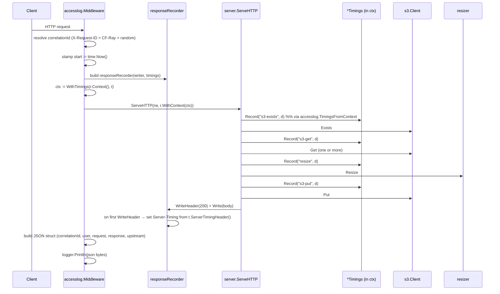

# Specification: Structured access logs + Server-Timing header

| Field | Value |
|-------|-------|
| **Branch** | `add-access-logs-and-timings` → none |
| **Commit** | `21fdfb3` — fix: updating the tests and fixing an error on the normalized key |
| **Generated** | 2026-06-12T12:55:00Z |
| **Synced To** | `21fdfb3c6f1fc77bc3f10c54bd56e804e5ff0d86` |

**Track ID:** add-access-logs-and-timings
**Status:** [x] Complete

## Context References

- **Product:** `draft/product.md` — adds the "observability beyond `log.Printf`" P1 feature and unblocks the platform-wide response-time monitoring goal.
- **Tech Stack:** `draft/tech-stack.md` — stays inside the "stdlib only" idiom (`encoding/json`, `net/http`, `crypto/rand`, `time`); no new go.mod entries.
- **Architecture:** `draft/.ai-context.md` — touches `server` module's request lifecycle (FLOW:hot_path); introduces a new middleware-style wrapper layer above `ServeHTTP` and a timings accumulator threaded via `context.Context`.
- **Guardrails:** `draft/guardrails.md` — preserves the "`os.Getenv` only in `main.go`" and "constructor-injection through `types.*`" conventions; does NOT introduce a structured-logger library (zerolog/zap) to stay consistent with stdlib-only.

## Problem Statement

The proxy logs request-handling decisions with `log.Printf` as freeform text. Operators cannot:

1. Aggregate request volume / latency / status across this service and the rest of the stack (nginx upstreams already emit a structured JSON access line; this service breaks the dashboard).
2. Tell, from a single request, where time is being spent (S3 round-trip vs libvips resize vs cache write-back). This matters because resize CPU and S3 latency dominate the tail of the latency distribution but show up indistinguishably in a single `request_time` measurement.
3. Trace a single request from CDN → this service → S3, because there is no per-request correlation ID exposed to client tooling or downstream consumers.

## Background & Why Now

- The rest of the platform's nginx services emit a JSON access line with a fixed schema. Monitoring queries assume that schema. Adding this service to those queries requires emitting the same shape.
- Server-Timing is the standard browser-facing mechanism for surfacing per-phase server costs (W3C Server Timing API). DevTools and CDN edge dashboards already understand it.
- The hot path is small and well-defined (3 handlers, all in `internal/server/server.go`), so the cost of instrumentation is bounded.

## Requirements

### Functional

1. **Structured access log per request.** Every completed HTTP request emits a single JSON line matching the schema below. The line is written by a middleware layer that wraps `server.Server.ServeHTTP`; it is *not* assembled inside the handlers.
2. **Schema** (one JSON object per request, fields nullable per row 3 below):
   ```json
   {
     "@timestamp": "<RFC3339Nano UTC>",
     "extra": { "correlationId": "<id>" },
     "user": {
       "ip": "<remote_addr from RemoteAddr, X-Forwarded-For honored>",
       "cloudflare": "<CF-Connecting-IP header>",
       "name": "<HTTP basic-auth user, empty if absent>",
       "referrer": "<Referer header>",
       "agent": "<User-Agent header>"
     },
     "request": {
       "time": <total request time in seconds, float, 3 decimals>,
       "url": "<r.URL.Path>",
       "method": "<r.Method>",
       "scheme": "<https if X-Forwarded-Proto=https or TLS != nil, else http>",
       "size": <content-length of request body in bytes, int, or 0>,
       "host": "<Host header>",
       "query": "<raw query string, empty if none>",
       "contentType": "<Content-Type header>"
     },
     "response": {
       "status": <int>,
       "bytes": <int — bytes written to response body>,
       "routing_group": "<empty — preserved for schema compatibility>"
     },
     "upstream": {
       "responseTime": <sum of all S3 + libvips durations in seconds, float, 3 decimals>,
       "upstreamHost": "<S3 endpoint URL or bucket name>",
       "version": "",
       "preloading": ""
     }
   }
   ```
   - `extra.correlationId` is resolved in this order: `X-Request-ID` header → `CF-Ray` header → freshly generated 16-byte random hex.
   - The chosen correlationId is echoed back in the response as `X-Request-ID` so downstream layers / browsers can correlate.
   - `upstream` is repurposed for this Go origin: `responseTime` aggregates internal phase durations; `upstreamHost` is the S3 endpoint or bucket. `version` and `preloading` are kept as empty strings to preserve schema shape.
3. **All schema keys are always present** (even when value is empty string, null, or 0). Monitoring queries that test for key presence keep working.
4. **Server-Timing response header on every 2xx and 3xx response**, format per W3C Server-Timing:
   ```
   Server-Timing: s3-exists;dur=2.1, s3-get;dur=14.7, resize;dur=63.2, s3-put;dur=9.8
   ```
   - Phase names (lowercase, hyphenated): `s3-exists`, `s3-get`, `resize`, `s3-put`.
   - Durations are in milliseconds with 1 decimal.
   - Phases that did not execute in this request are omitted from the header.
   - On 4xx / 5xx responses, the header SHOULD still be emitted if any phase ran (helps debug a slow-then-failing request); if no phase ran, the header is absent.
5. **Phase timing instrumentation** is added at exactly these call sites in `internal/server/server.go` (and `internal/s3/s3.go` if the timer needs to capture fallback transparently):
   - `s3-exists` — wraps the `s3Client.Exists` call in `ServeHTTP` and (when triggered) the normalized-key existence check.
   - `s3-get` — wraps every `s3Client.Get` call across cached-hit, candidate-key loop, and file passthrough.
   - `resize` — wraps the `s.resizer.Resize` call in `handleResize`.
   - `s3-put` — wraps every cache-back `s3Client.Put` call in `handleResize` and `handleFile`.
6. **Phase timings accumulate per call** (e.g., if `Get` is called three times in the candidate-key loop, `s3-get` reports the sum of all three, not just the successful one).
7. **The structured access log is the only required logging change.** Existing `log.Printf` debug lines in handlers stay as they are. The access logger is a separate `log.Logger` instance writing to `os.Stdout` with no prefix so it is easy to route in Docker / CircleCI.

### Non-Functional

1. **Zero new external dependencies.** Implementation uses only `encoding/json`, `crypto/rand`, `encoding/hex`, `net/http`, `time`, `sync`, `context`, `strings`, `strconv`, `os`, `log`.
2. **No measurable latency overhead on the hot path.** Acceptance threshold: p99 latency for cached-hit requests in unit benchmark stays within 5% of pre-change. (The whole pipeline is a few `time.Now()` calls + one `json.Marshal` per request — this is not at risk, but we measure to be sure.)
3. **Thread-safe timing accumulator.** A single request's timings are accessed only from the handling goroutine, but the type must be safe to use from the fire-and-forget worker goroutine (`server.go:293-298`) if a future change wants to log it too. Guarded by `sync.Mutex` if any caller writes to it from more than one goroutine.
4. **Backwards compatibility:**
   - Existing tests for `Server` continue to pass — the structured log line is additive, not a replacement.
   - The Cache-Control header invariants (architecture.md I5) are preserved.
   - The cache-back invariant (I3) is preserved.
   - The worker-trigger fire-and-forget contract (I10) is preserved — that endpoint still returns 202 immediately. Its access log line records `status=202`, `request.time` = the time to dispatch (small), and contains no S3 phase timings since the resize happens after the response is closed.
5. **Privacy.**
   - No cookies are read or logged. The `cart` cookie present in the original nginx template is intentionally omitted — it is not useful for an image service and may carry session state.
   - No request bodies are logged. No Authorization header is logged. No S3 secret keys are logged.

## Acceptance Criteria

- [ ] **AC1 (schema).** A `curl` to any of the three URL families produces exactly one JSON line on stdout whose top-level keys match the spec, in the same order, with the same nesting, every time.
- [ ] **AC2 (correlationId precedence).** With `X-Request-ID: abc123` on the request, the access log shows `correlationId=abc123` and the response includes `X-Request-ID: abc123`. With only `CF-Ray: ray-xyz` on the request, the log shows `correlationId=ray-xyz`. With neither, the log shows a 32-character lowercase hex string and the response echoes it back.
- [ ] **AC3 (Server-Timing phases).** A `curl -I` to a cached-miss URL (force a resize) returns `Server-Timing` containing `s3-exists`, `s3-get`, `resize`, and `s3-put` entries with positive `dur` values. A `curl -I` to a cached-hit URL returns `Server-Timing` containing `s3-exists` and `s3-get` only.
- [ ] **AC4 (Server-Timing on errors).** A `curl -I` to a URL whose original cannot be found (404 from `handleResize`) still returns `Server-Timing` containing `s3-exists` and one or more `s3-get` entries.
- [ ] **AC5 (upstream-block compatibility).** The access log emits `upstream.upstreamHost = <bucket or endpoint>`, `upstream.responseTime = <sum of phases in seconds>`, and `upstream.version = ""`, `upstream.preloading = ""`.
- [ ] **AC6 (no cookie read).** The middleware does not read any cookie from the request. The `user` block in the log line has exactly five keys: `ip`, `cloudflare`, `name`, `referrer`, `agent`.
- [ ] **AC7 (status + bytes).** The `response.status` and `response.bytes` fields match the actual HTTP status and `Content-Length` (or counted bytes if no Content-Length is set) of the response.
- [ ] **AC8 (worker trigger).** `POST /_/worker/trigger` produces one log line with `status=202`, `response.bytes > 0` ("Accepted"), and no S3 phase timings (because the resize happens after the response is closed).
- [ ] **AC9 (invariant preservation).** `make test` (Alpine) passes. Cache-Control `max-age=31536000` is still set on 2xx image responses. Cache-Control `max-age=30` is still set on error responses.
- [ ] **AC10 (no new deps).** `go.mod` is unchanged.

## Non-Goals

- **Metrics export (Prometheus / OpenTelemetry).** Out of scope; this is access-log + Server-Timing only. A separate track can read the structured log line and ship metrics if needed.
- **Distributed tracing context propagation.** We honor X-Request-ID but do not emit / propagate W3C `traceparent`.
- **Logging the request body or response body bytes** beyond the byte count.
- **Per-tenant log routing.** All requests log to the same stream.
- **Sampling.** Every request is logged.
- **Refactoring `internal/server/server.go` beyond what's needed to add timer call-sites.** The regex ladder and key-normalization stay as they are.
- **Changing `log.Printf` debug lines** elsewhere in the codebase. This track does not introduce a project-wide structured logger.
- **Adding auth on `POST /_/worker/trigger`.** Tracked separately (see `draft/architecture.md` §9 #7).

## Technical Approach

### Module layout

A new internal package `internal/accesslog` holds the orphan-of-`server`-and-`main`-only bits so `server` stays focused on routing:

```
internal/accesslog/
  middleware.go     # Handler wrapper; correlationId resolution; final marshal + emit
  timings.go        # *Timings type — phase timer accumulator (sync.Mutex)
  writer.go         # responseRecorder wrapping http.ResponseWriter; status + bytes capture; Server-Timing on WriteHeader
  log.go            # AccessLogger — wraps a *log.Logger
  context.go        # context key for *Timings, getter + Track() helper
  middleware_test.go
  timings_test.go
  writer_test.go
```

Public surface (additions to `internal/types/types.go` are NOT required — the new types live in `accesslog`):

```go
// internal/accesslog
type Logger struct { l *log.Logger }
func NewLogger(out io.Writer) *Logger

type Timings struct { /* mu sync.Mutex; phases map[string]time.Duration */ }
func (t *Timings) Record(phase string, d time.Duration)
func (t *Timings) Track(phase string, fn func() error) error  // convenience wrapper
func (t *Timings) Total() time.Duration
func (t *Timings) ServerTimingHeader() string  // "s3-get;dur=12.3, resize;dur=45.6"

// Middleware wraps an http.Handler with access-log + Server-Timing capture.
// upstreamHost is the static S3 endpoint/bucket to emit in upstream.upstreamHost.
func Middleware(next http.Handler, logger *Logger, upstreamHost string) http.Handler

// Context helpers for handlers to record phase timings without knowing about the middleware.
func TimingsFromContext(ctx context.Context) *Timings
```

### Request lifecycle (after change)



### Key implementation decisions

- **Why a middleware vs. embedding logging in `Server.ServeHTTP`:** The middleware is what guarantees that every request — including `POST /_/worker/trigger`, panic-recovered requests (if added later), and any future handler — is logged. Embedding the logic in `Server.ServeHTTP` would make `handleWorkerTrigger`'s log line easy to forget.
- **Why phase timings via `context`, not a thread-local global:** Go has no thread-locals; context is the canonical request-scoped data plumber and is already passed everywhere in this codebase.
- **Why hand-rolled JSON instead of slog:** Project is Go 1.19 (`go.mod:3`); `log/slog` arrived in 1.21. Bumping Go is out of scope for this track. The schema is fixed and small — `encoding/json.Marshal` over a typed struct is the right tool.
- **Why `os.Stdout` for access logs while errors go to `os.Stderr`:** Standard 12-factor split; the existing `log.Printf` (operational/error log) continues to go to stderr; access logs go to stdout. Docker container log routing handles them separately.
- **`responseRecorder.WriteHeader` sets Server-Timing exactly once.** Phase timings recorded *after* the first `WriteHeader` are still captured in the access log but do not appear in the header (the header has already been sent). This matters for `handleResize`: the cache-back `s3-put` happens *after* `w.Write` in the current code path, so as written, `s3-put` would not make it into Server-Timing.
  - **Mitigation:** restructure `handleResize` so that Server-Timing-relevant timings (including `s3-put`) are recorded *before* `w.Write(resizedData)` is called. This means: do `s3.Put` first, then set Server-Timing implicitly via the first `Write`, then `Write` the body.
  - Trade-off: a `s3.Put` failure delays the first byte to the client by ~10ms. Today, `s3.Put` failure is logged but does not fail the request; the client still gets the resized bytes. We preserve that. Net effect: client sees +~10ms on a cache-miss path in exchange for accurate `s3-put` Server-Timing.
- **`X-Request-ID` echoing.** Done in middleware before `next.ServeHTTP`, by `rw.Header().Set("X-Request-ID", correlationId)`. Note that headers set on `rw` will be sent only on first `WriteHeader`, so the echo is automatic.

### Files touched

- New: `internal/accesslog/{middleware,timings,writer,log,context}.go` + tests.
- Modified: `cmd/image-proxy/main.go` — wrap `srv` with `accesslog.Middleware(srv, accessLogger, upstreamHost)` before `http.ListenAndServe`.
- Modified: `internal/server/server.go` — wrap every `s.s3Client.Exists / Get / Put` and `s.resizer.Resize` call in `accesslog.TimingsFromContext(ctx).Track(phase, ...)`. Reorder `handleResize` so `s3.Put` happens before `w.Write`.
- Modified: `internal/server/server_test.go` — assertions for Server-Timing header presence on a representative test or two. Existing tests should keep passing without modification.
- **Not modified:** `internal/s3/s3.go`, `internal/resizer/resizer.go`, `internal/worker/worker.go`, `internal/types/types.go`. The instrumentation lives at the call sites in `server`, keeping the lower layers oblivious. This also means the fallback-bucket round-trips inside `s3.Client.Get` are observed as a single `s3-get` phase from the server's perspective — which is the operationally useful granularity.

### Scheme detection

```go
scheme := "http"
if r.TLS != nil || strings.EqualFold(r.Header.Get("X-Forwarded-Proto"), "https") {
    scheme = "https"
}
```

### Bytes-sent counting

`responseRecorder.Write(b []byte) (int, error)` adds `len(b)` to a running counter and forwards to the underlying writer. `Content-Length` is not relied upon (handlers do not currently set it).

### upstreamHost selection

In `main.go`, the value passed to `accesslog.Middleware` is:
- `S3_ENDPOINT` env var if set (e.g., Hetzner endpoint URL), else
- `bucket + ".s3." + region + ".amazonaws.com"` (informational, not a real DNS lookup).

This single value is logged on every request. It is informational (matches what nginx prints), not used for routing.

## Success Metrics

| Category | Metric | Target | Measurement |
|----------|--------|--------|-------------|
| Quality | All existing tests pass | 100% | `make test` and `make test-debian` |
| Quality | New unit tests for `internal/accesslog` | ≥ 10 cases | `go test -v ./internal/accesslog/...` |
| Performance | Hot-path overhead (cached hit) | < 5% p99 latency increase | Microbenchmark in `accesslog/middleware_test.go` against the existing `Server` |
| Operations | Monitoring queries that aggregate over the existing nginx schema include this service without query changes | Yes / No | Manual smoke check after deploy on a sample query |
| Schema | Every log line is valid JSON parseable by `json.Unmarshal` into a known struct | 100% | Unit test in `middleware_test.go` |

## Stakeholders & Approvals

| Role | Name | Approval Required | Status |
|------|------|-------------------|--------|
| Owner | thomas@kasasagi.dk | Spec sign-off, architecture review, QA review | [x] (single-maintainer project) |

### Approval Gates

- [x] Spec approved (single maintainer)
- [x] Architecture reviewed (uses existing patterns; no new top-level dependency)
- [x] Security check: no cookies are read; no Authorization header is logged; no request body is logged.

## Risk Assessment

| Risk | Probability | Impact | Score | Mitigation |
|------|-------------|--------|-------|------------|
| Reordering `handleResize` (Put-before-Write) introduces a regression in the resize/cache contract | 2 | 4 | 8 | Keep the existing "Put failure is logged, not returned" semantics. Cover with a unit test where Put fails — Write must still happen. |
| Per-request `json.Marshal` adds detectable overhead on cached-hit path | 2 | 2 | 4 | Microbenchmark the middleware (`middleware_test.go`). If p99 grows > 5%, revisit (e.g., reuse buffers via `sync.Pool`). |
| `responseRecorder.WriteHeader` for headers set after the first write get silently dropped (Go stdlib behavior) | 3 | 3 | 9 | Recorder explicitly serializes Server-Timing into the underlying writer's header set *before* delegating to `WriteHeader`. Covered by a test where a phase is recorded before any write and one is recorded after — header reflects the pre-write set; log reflects both. |
| `upstream.upstreamHost` value differs from nginx convention enough to break a dashboard query | 2 | 2 | 4 | The field is preserved; only the *value* shape changes. Coordinate with whoever maintains the dashboard after deploy. |
| Generating a UUID with `crypto/rand` fails (rare; entropy starvation in containers) | 1 | 2 | 2 | Fall back to a timestamp-derived ID; log the error once. |

## Deployment Strategy

### Rollout Phases

1. Deploy to staging container (if any), watch first few hundred log lines for schema correctness.
2. Deploy to production via existing CircleCI → Docker Hub pipeline. No feature flag needed — the change is additive (new log stream, new response header) and does not alter image content or status codes.
3. After deploy, run a representative sample query in the monitoring stack to confirm this service's logs are joining cleanly with the rest of the platform's logs.

### Feature Flags

None. The change is small and additive. A rollback is `git revert` + image redeploy.

### Rollback Plan

- **Trigger:** monitoring shows malformed log lines OR Server-Timing header content interferes with a downstream consumer.
- **Process:** revert the merge commit, redeploy.
- **Data rollback:** N/A (only logs and a response header changed).

### Monitoring

- Stdout will now carry JSON access lines; stderr keeps the existing `log.Printf` debug stream.
- Key post-deploy checks:
  - `response.status` distribution matches expectations (no spike in 5xx).
  - `request.time` p50/p95/p99 are similar pre/post.
  - `upstream.responseTime` is a sensible fraction of `request.time` (resize-heavy requests should show resize dominance; cached hits should be tiny).

## Open Questions

| # | Question | Owner | Resolution |
|---|----------|-------|------------|
| Q1 | Does the `cart` cookie carry PII, session tokens, or only an opaque cart identifier? | owner | **Resolved 2026-06-12: drop the field entirely — not relevant for an image service.** |
| Q2 | Is there an existing convention for `upstream.upstreamHost` value in the platform's nginx logs (e.g., "1.2.3.4:8080" socket form) that we should match? Or is the bucket/endpoint string acceptable? | owner | pending — not blocking, can adjust post-merge if needed |
| Q3 | Should logs go to stdout (default proposed) or stderr to match the existing `log.Printf` stream? | owner | proposed: stdout (12-factor). Confirm during review. |

## Conversation Log

- **Decision:** Repurpose the `upstream` block for S3 calls (`upstream.responseTime` = sum of S3+libvips durations; `upstream.upstreamHost` = S3 endpoint or bucket). The `x-routing-group`, `x-dreamshop-version`, `x-dreamshop-preloading` fields stay as empty strings to preserve schema shape for monitoring queries.
- **Decision:** correlationId resolution order is `X-Request-ID` → `CF-Ray` → freshly generated 16-byte hex. The chosen value is echoed in the response `X-Request-ID` header.
- **Decision:** All four Server-Timing phases (`s3-exists`, `s3-get`, `resize`, `s3-put`) are reported.
- **Decision:** `handleResize` must be reordered so `s3.Put` happens *before* `w.Write(resizedData)`, so `s3-put` appears in Server-Timing. The existing "Put failure does not fail the request" semantic is preserved (failure is logged, body is still written).
- **Decision:** New code lives in a new `internal/accesslog` package; no changes to `internal/types`, `internal/s3`, `internal/resizer`, or `internal/worker`. Stays inside the project's stdlib-only, constructor-injection idiom.
- **Decision:** No Go-version bump for `log/slog`. Hand-rolled `encoding/json.Marshal` over a typed struct is the right tool at this size.
- **Decision (2026-06-12):** Drop the `user.cart` field from the schema. It is not useful for an image service and would log session state for no operational benefit. Q1 resolved.
