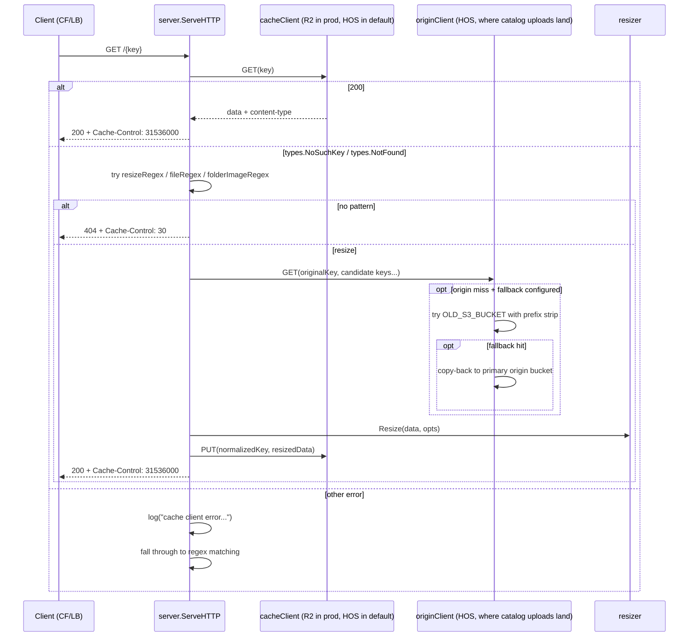

# Specification: Split origin/cache buckets + single-GET cache-hit path

| Field | Value |
|-------|-------|
| **Branch** | `split-origin-and-cache-buckets` → none |
| **Commit** | `2718fce` — feat: structured access logs + Server-Timing header (#1) |
| **Generated** | 2026-06-13T17:05:00Z |
| **Synced To** | `2718fcead03a1597b02f831ac8ea1175a7aa11eb` |

**Track ID:** split-origin-and-cache-buckets
**Status:** [x] Complete

## Context References

- **Product:** `draft/product.md` — advances the "P1: observability beyond log.Printf" goal indirectly (better cache-hit latency in the data the access logs already capture) and the cost-efficient-cache goal (R2 zero egress + Cloudflare anycast).
- **Tech Stack:** `draft/tech-stack.md` — preserves stdlib-only + AWS SDK v2; introduces a second `*s3.Client` instance and uses AWS SDK v2 typed errors (`*types.NoSuchKey`/`*types.NotFound`). No new go.mod entries.
- **Architecture:** `draft/.ai-context.md` § FLOW:hot_path — re-shapes the hot path from `HEAD → GET-on-hit / regex-on-miss` to `GET-on-cache → regex-on-miss`. Closes the dead-code paths `architecture.md §9 #4` (worker.destS3Client) and explicitly classifies the silent-error fall-through flagged in `architecture.md §9 #8`.
- **Guardrails:** `draft/guardrails.md` — preserves "`os.Getenv` only in `main.go`" and "constructor-injection through `types.*`". Removes the silent-no-op Tagging usage; updates the mock pattern in tests to match the simpler `Put` signature.
- **Prior track:** `add-access-logs-and-timings` (merged 2026-06-13) — Server-Timing already reports per-phase durations. This track changes the *number* of phases on the cache-hit path (from 2 → 1) so dashboards keyed on `s3-exists` presence will see fewer entries; not a regression but worth flagging in the deploy note.

## Problem Statement

Two specific costs on the cache-hit hot path:

1. **One unnecessary S3 round-trip per cache hit.** `ServeHTTP` (`server.go:64-78`) does `s.s3Client.Exists(ctx, key)` (HEAD), then `s.s3Client.Get(ctx, key)` (GET) only if the HEAD returned 200. On a hit this is always two round-trips to the same key. The HEAD-then-conditional-GET pattern is unnecessary because the GET itself returns the same information (200 vs 404) plus the body we will need on a hit.

2. **All traffic — including the dominant cache-hit traffic — goes to Hetzner Object Storage, which is explicitly documented as not designed for latency-sensitive workloads and optimized for files ≥1 MB.** Resized thumbnails are usually well under 1 MB, putting the hot path in the worst part of HOS's design envelope. Migration to a storage backend that fits the workload (Cloudflare R2: anycast-served reads, zero egress, fits well with the existing Cloudflare-fronted topology) requires architectural prep: the proxy cannot today distinguish "where the upstream catalog system writes originals" from "where the proxy writes resized variants."

Secondary defects this track sweeps up because they are coupled to (1) and (2):

3. **`IMAGE_TAGS` Tagging usage is a silent no-op on HOS** (HOS doesn't implement S3 Tagging APIs) and will hard-fail on R2 (R2 returns `NotImplemented`). Today's `s3.Client.Put` sends a `Tagging` header on every PUT; this is a hidden bug now and a release blocker for any R2-backed deploy.

4. **`Exists` errors are silently misclassified as "not exists"** (`server.go:65-67`, also flagged in `architecture.md §9 #8`). With the GET-instead-of-HEAD change we need an explicit miss-vs-error classifier anyway, so fixing this is "free."

5. **`worker.destS3Client` is plumbed through `NewWorker` but always passed `nil`** (`architecture.md §9 #4`). The split-bucket wiring gives this field its first meaningful value (the cache client), closing the dead-code path.

## Background & Why Now

- The previously-merged `add-access-logs-and-timings` track instrumented `s3-exists`, `s3-get`, `resize`, and `s3-put` phase durations in Server-Timing and the structured access log. We now have per-phase wall-clock data in production. The data shows the cache-hit path is dominated by the unnecessary HEAD round-trip — exactly the cost this track removes.
- Deep research (run 2026-06-13, see prior session) confirmed: (a) HOS vendor docs explicitly disclaim sub-MB/<1ms workloads, (b) HOS and R2 both lack Tagging support — refactoring to R2 requires Tagging removal regardless of direction, (c) Cloudflare R2's anycast topology aligns with the existing Cloudflare CDN in front of the proxy.
- The codebase already has a `fallbackClient` pattern in `s3.Client` for lazy migration of legacy bucket layouts. That mechanism stays on the **origin** client; the cache client does not get a fallback (a cache miss is just a fall-through to the regex/resize path). The fallback mechanism does not generalize to "fall back to a different provider for resized variants" — that role is filled by the two-client split itself.

## Requirements

### Functional

1. **Two-client architecture.** `server.Server` and `worker.Worker` are constructed with two `types.S3Client` references: `originClient` (where originals live, written by the upstream catalog system) and `cacheClient` (where the proxy writes resized variants).

2. **Backwards-compatible env defaults + mode toggle.** `main.go` reads:
   - **Credentials:** `CACHE_BUCKET`, `CACHE_S3_ENDPOINT`, `CACHE_AWS_ACCESS_KEY_ID`, `CACHE_AWS_SECRET_ACCESS_KEY`, `CACHE_AWS_REGION`. Optional.
   - **`CACHE_MODE`** (default `off`): one of `off | shadow | live`.
     - `off`: single-client behavior — the cache client is not constructed even if credentials are set. Today's behavior.
     - `shadow`: cache client is constructed; **default reads come from origin**, every write target dual-writes to both origin and cache. Used to populate the cache while keeping users unaffected.
     - `live`: cache client is constructed; **default reads come from cache** (origin is consulted only on the resize-miss pipeline); every write target dual-writes to both. Used after `shadow` has populated enough of the catalog.
   - Sanity at startup: if `CACHE_MODE != off` but `CACHE_BUCKET` is unset → `log.Fatal`. If `CACHE_MODE = off` and any other `CACHE_*` var is set → log a single warning and ignore (avoids silent footguns).

3. **Single-GET cache-hit path with mode-aware read source.** In `ServeHTTP`, replace the HEAD-then-conditional-GET block with one `effectiveReadClient.Get(ctx, key)` call. `effectiveReadClient` is selected by the mode-and-header dispatch (see §F8). On success, set `Content-Type` and `Cache-Control: max-age=31536000` and return the body. On error, classify (see §F4) and either treat as miss (fall through to regex matching) or log + fall through (preserving today's fail-open semantic).

4. **Typed-error miss classification.** Replace the string-matching against `err.Error()` in `s3.Client.Get` / `s3.Client.Exists` with AWS SDK v2 typed-error matching: `errors.As(err, *types.NoSuchKey)` or `errors.As(err, *types.NotFound)`. A typed not-found is a clean miss; any other error is a "real" error and is logged at the call site. The `ServeHTTP` cache-check is fail-open (logs + falls through to regex matching on a non-not-found error). The `handleResize` candidate-key loop is fail-soft per-iteration (skip and try next on any error, surface the last error if all candidates fail) — same as today.

5. **`IMAGE_TAGS` deprecation.** `s3.Client.Put` loses its `tags map[string]string` parameter. The `Tagging` header is no longer sent on PUT. The `types.S3Client.Put` interface signature changes correspondingly. `main.go` still reads `IMAGE_TAGS` for backwards-compat; if set to a non-empty value, log a single startup warning (`accesslog: IMAGE_TAGS is deprecated and ignored — HOS and R2 do not implement S3 Tagging`) and discard. `s3.Client.SetDefaultTags` and the `defaultTags` field are removed.

6. **Worker `destS3Client` wiring.** `server.NewServer` constructs its internal worker with `destS3Client = cacheClient` (was `nil`). `Worker.ProcessProductImage` already prefers `destS3Client` over `s3Client` when non-nil (`worker.go:88-91`); that branch becomes live for the first time. The `forceOverwrite=false` semantic is preserved.

7. **Worker fire-and-forget contract preserved.** `POST /_/worker/trigger` still returns 202 immediately. The detached goroutine in `handleWorkerTrigger` still uses `context.Background()` (no access-log timings).

8. **Per-request read-source override via `X-Use-Cache` header.** When `CACHE_MODE != off`, requests may carry the `X-Use-Cache` request header to override the default read source for one request:
   - `X-Use-Cache: true` → read from cache client for this request (overrides the `shadow` default of "read from origin").
   - `X-Use-Cache: false` → read from origin client for this request (overrides the `live` default of "read from cache").
   - Any other value, or header absent → use the mode's default.
   - Header is no-op when `CACHE_MODE = off`.
   - Writes are **not** affected by the header — dual-write semantics depend only on `CACHE_MODE`. The header only re-routes the cache-hit Get.
   - Use case: hit URLs from a synthetic monitor with `X-Use-Cache: true` while running in `shadow` mode to test cache read performance without affecting real traffic.

9. **Dual-write semantics in `shadow` and `live` modes.** Every cache-back PUT (in `handleResize`, `handleFile`, and the worker's `ProcessProductImage`) writes the resized variant to **both** the origin client AND the cache client. Order:
   - In `shadow` mode: origin first, then cache. Origin is the historically authoritative bucket; failing on origin would be a regression. Cache write is best-effort and informational at this stage.
   - In `live` mode: cache first, then origin. Cache is now the primary; failing on cache is the more meaningful signal. Origin write is belt-and-suspenders.
   - In both modes: a write failure on either side is logged via `log.Printf("dual-write {side} failed for %s: %v", ...)` but **does not fail the request**. This preserves today's "Put failure doesn't break the response" contract (architecture.md §2 I3 semantics intact — the cache layer is best-effort by design).
   - Writes are sequential, not parallel. Parallel dual-write is a separate optimization (a sibling of the fire-and-forget Put track that's already on the follow-up list).

10. **Server-Timing phase names reflect the dual-write topology.** In `off` mode, the cache-back PUT remains a single `s3-put` phase (backwards-compatible with any dashboards keyed on this name). In `shadow` or `live` modes, the two writes are timed under distinct phase names: **`s3-put-cache`** and **`s3-put-origin`**. The bare `s3-put` phase name is not emitted in dual-write modes.

11. **Origin-side fallback bucket (`OLD_S3_BUCKET`) unchanged in role.** The existing lazy-migration `fallbackClient` mechanism (`s3.go:70-95`) stays on the origin client only. The cache client never has a fallback. The lazy-migration copy-back (`s3.go:127-130`) targets the origin client.

### Non-Functional

1. **Zero new go.mod entries.** Implementation uses only stdlib + already-imported AWS SDK v2 packages.

2. **One PR. One env-var flip to roll out.** The PR is shippable with `CACHE_BUCKET` unset and is a no-op deploy in single-client mode. Production opts into split mode by setting `CACHE_BUCKET` (etc.) and redeploying.

3. **No URL contract change.** Clients see identical URLs, identical response headers (modulo Server-Timing now reporting a single `s3-get` on cache hits instead of `s3-exists` + `s3-get`), identical content.

4. **No regression in invariants** from `architecture.md §2`:
   - I3 (resize output cached back): preserved — PUT to cacheClient.
   - I4 (normalized key is cache key): preserved.
   - I5 (Cache-Control max-age=31536000 on 2xx, max-age=30 on errors): preserved.
   - I6/I7 (fallback bucket lazy migration with prefix strip): preserved — origin-client only.
   - I8/I9 (vips lifecycle): unchanged.
   - I10 (worker fire-and-forget): preserved.
   - I11 (worker skip-existing-thumb): preserved; the existence check now targets cacheClient.
   - I12 (URL-escape tag values): removed — Tagging itself is gone.

## Acceptance Criteria

- [ ] **AC1 (off-mode is no-op default).** Deploying with `CACHE_MODE` unset (or `off`) produces identical behavior to today: same single-client wiring, same number of S3 calls per request pattern, `s3-put` phase name preserved.
- [ ] **AC2 (mode validation).** Setting `CACHE_MODE=shadow` or `CACHE_MODE=live` without `CACHE_BUCKET` causes a `log.Fatal` at startup with a clear message naming both env vars. Setting `CACHE_MODE=off` with `CACHE_BUCKET` defined logs a single warning (`CACHE_BUCKET is set but CACHE_MODE is off — cache client will not be constructed`).
- [ ] **AC3 (shadow mode read source = origin by default).** With `CACHE_MODE=shadow` and no `X-Use-Cache` header, the cache-hit Get goes to the origin client; the cache client is **never** read on the request path. Verified by mock call counts.
- [ ] **AC4 (live mode read source = cache by default).** With `CACHE_MODE=live` and no `X-Use-Cache` header, the cache-hit Get goes to the cache client. The origin client is consulted only on the resize-miss pipeline.
- [ ] **AC5 (`X-Use-Cache: true` override in shadow).** With `CACHE_MODE=shadow` and request header `X-Use-Cache: true`, the cache-hit Get goes to the cache client (override). The default reads-from-origin behavior is not affected for requests without the header.
- [ ] **AC6 (`X-Use-Cache: false` override in live).** With `CACHE_MODE=live` and request header `X-Use-Cache: false`, the cache-hit Get goes to the origin client (override).
- [ ] **AC7 (header no-op in off mode).** With `CACHE_MODE=off`, the `X-Use-Cache` header has no effect (no cache client exists to read from); behavior is identical with or without the header.
- [ ] **AC8 (single-RTT cache hit).** In any mode and any header combination, a cache-hit request makes exactly **one** S3 round-trip to whichever client is the effective read target — verified by mock call counts.
- [ ] **AC9 (Server-Timing in off mode).** With `CACHE_MODE=off`, a cache-miss resize request emits Server-Timing phases `s3-get` (cache check), candidate `s3-get`s, `resize`, and `s3-put` (single phase name — backwards compat with existing dashboards).
- [ ] **AC10 (Server-Timing in shadow/live).** With `CACHE_MODE` in `shadow` or `live`, a cache-miss resize request emits Server-Timing phases `s3-get`, candidate `s3-get`s, `resize`, **`s3-put-cache`**, and **`s3-put-origin`** (two distinct put phases, no bare `s3-put`).
- [ ] **AC11 (dual-write happens in both shadow and live).** With `CACHE_MODE` in `shadow` or `live`, every cache-back PUT in `handleResize`, `handleFile`, and worker `ProcessProductImage` writes to **both** clients. Verified by mock call counts: both `originClient.putFunc` and `cacheClient.putFunc` are called exactly once per cache-back.
- [ ] **AC12 (dual-write order).** In `shadow` mode, origin Put is called before cache Put. In `live` mode, cache Put is called before origin Put. Verified by mock recording call order.
- [ ] **AC13 (dual-write failure is non-fatal).** When either side of the dual-write fails (synthetic error in the mock), the request still succeeds (response body is the resized data), the failure is logged with `dual-write` in the message, and the other side's Put is still attempted.
- [ ] **AC14 (typed-error miss classification).** When the effective read client returns `*types.NoSuchKey` or `*types.NotFound`, the request falls through cleanly to regex matching with no error log line. When it returns any other error (synthetic 5xx in a test), the request still falls through (fail-open) but emits a `log.Printf("cache client error for %s: %v", ...)` line.
- [ ] **AC15 (Tagging gone).** No `PutObjectInput.Tagging` field is set anywhere in the codebase (`grep -r "Tagging:" internal/ cmd/`). The `s3.Client.Put` signature has no `tags` parameter. The `types.S3Client.Put` interface signature has no `tags` parameter. `IMAGE_TAGS` env var, if set to non-empty, logs a single startup deprecation warning.
- [ ] **AC16 (origin fallback preserved).** Setting `OLD_S3_BUCKET` still triggers the lazy-migration read-through + copy-back on the **origin** client only. The cache client never consults a fallback.
- [ ] **AC17 (worker pre-warm respects mode).** With `CACHE_MODE=shadow` or `live`, `worker.ProcessProductImage` dual-writes (origin AND cache). With `CACHE_MODE=off`, behavior is identical to today (single-client write).
- [ ] **AC18 (tests + format).** `make test` (Alpine) and `make test-debian` pass. `gofmt -l` reports no rewrites needed. `go vet ./...` clean.
- [ ] **AC19 (no new deps).** `go.mod` and `go.sum` unchanged.
- [ ] **AC20 (rollback is an env flip).** Changing `CACHE_MODE` from `live` → `shadow` → `off` and restarting at each step is non-destructive: cache contents remain in R2 (unused in `off`); HOS contents remain in HOS; all transitions are env-only.

## Non-Goals

- **Parallel candidate-key GETs in `handleResize`.** Out of scope. Separate track, expected next.
- **Fire-and-forget cache-back PUT to R2.** Out of scope. We want one full deploy cycle of `s3-put` timing data on the new architecture before deciding whether the latency win justifies losing Server-Timing visibility.
- **AWS SDK v2 `http.Transport` tuning (`MaxIdleConnsPerHost` etc.).** Out of scope. Separate, low-risk track.
- **Cloudflare Cache Rule pinning to override origin TTL.** Dashboard config, not code. Belongs in a runbook, not a code track.
- **Automatic cache invalidation when an original is replaced in HOS.** Same situation as today; not a regression. If it becomes operationally painful, separate track.
- **R2 bucket creation, credential provisioning, k3s secret rollout.** Operational, not in the code change. Plan calls out the steps but they happen out-of-band.
- **Removing `Exists` from the `types.S3Client` interface.** The worker's `ProcessProductImage` still uses it (skip-existing-thumb check), so it stays in the interface. Only the *server's* hot-path use of `Exists` goes away.
- **Changes to the `OLD_S3_*` fallback semantics.** Stays exactly as it is; only the role boundary moves (it's now "fallback for the origin client" instead of "fallback for the only client").

## Technical Approach

### Module layout (after change)

```
internal/types/types.go
  S3Client interface         // Put signature loses `tags` param

internal/s3/s3.go
  Client                     // SetDefaultTags removed; defaultTags field removed
  Put(ctx, key, data, contentType) error      // signature change
  Exists, Get                 // typed-error classification

internal/server/server.go
  Server struct              // s3Client field → originClient + cacheClient
  NewServer(originClient, cacheClient types.S3Client, sizes [][]int, format string) *Server
  ServeHTTP                  // HEAD-then-GET → single GET on cacheClient
  handleResize, handleFile   // origin reads on originClient, cache writes on cacheClient

internal/worker/worker.go
  NewWorker, Worker          // unchanged signature (already accepts destS3Client)
                              // s3Client → originClient, destS3Client → cacheClient
                              // forceOverwrite=false unchanged

cmd/image-proxy/main.go
  // Build originClient (existing path)
  // Build cacheClient = originClient by default
  // If CACHE_BUCKET set: build a second *s3.Client → cacheClient = that
  // Construct Server with (originClient, cacheClient, ...)
  // Construct worker indirectly via Server (server.NewServer wires the worker internally)
  // Log IMAGE_TAGS deprecation if non-empty
```

### Request lifecycle (after change)



### Key implementation decisions

- **Why two clients instead of a "role-aware" interface.** Constructor injection through two interface references keeps the change orthogonal to the `S3Client` interface itself. Tests already use a struct-of-function-pointers mock; making two of those is trivial.
- **Why preserve the single-client default.** Production rollout is "ship the PR, redeploy, then flip an env var" — three discrete steps where any of the first two can be rolled back without touching env. R2 bucket provisioning happens off-codebase.
- **Why drop `Tagging` instead of conditionally suppressing it.** HOS silently drops it today (no-op), R2 rejects it. Conditional logic for "only when targeting HOS" buys us nothing — the feature was never actually working.
- **Why typed-error matching.** `errors.As` against `*types.NoSuchKey`/`*types.NotFound` is the canonical AWS SDK v2 pattern. The current `strings.Contains(err.Error(), "NotFound")` (`s3.go:84`) is fragile against SDK error-rendering changes and was flagged in `architecture.md §9 #8` as a silent-error-classifier bug. Same code change fixes the classification on both `Get` and `Exists`.
- **Why keep `Exists` on the interface.** The worker's skip-existing-thumb check (`worker.go:81-86`) still uses it. Removing it from the interface would force a redundant Get-and-discard-body pattern in the worker just to know "does this exist?", which is wasteful when no body is actually consumed.
- **Why three modes (`off|shadow|live`) instead of two orthogonal booleans (`enabled`, `read_from_cache`).** The three modes encode the natural migration progression: `off` → `shadow` (populate without affecting users) → `live` (cut over reads). Two booleans expose 4 states, two of which are equivalent (`enabled=false, read_from_cache=*`) and one is rarely useful (`enabled=true, read_from_cache=true` but with no prior populate phase). The mode enum makes the operator's intent explicit.
- **Why a request header for read-source override.** Operator wants to test cache read performance from a synthetic monitor without affecting real traffic. A request header is the right granularity (per-request, override-only, no state). Alternatives considered: a query parameter (pollutes URL shape, may interact with cache layers above); a sticky cookie (stale state, cookie management overhead).
- **Why `X-Use-Cache: true|false` (boolean) instead of `X-Read-Source: cache|origin` (enum).** The header is a per-request override of a binary dimension (cache vs origin); a boolean is simpler and matches the operator's mental model ("use the cache for this request").
- **Why sequential dual-write rather than parallel.** Simplicity. Parallel dual-write doubles the failure surface (two error channels to plumb) for a write-side latency saving that is moot in `shadow` mode (operator doesn't care about miss-path latency yet) and is the subject of a planned follow-up track in `live` mode (fire-and-forget). Sequential keeps this PR focused.
- **Why `s3-put-cache` and `s3-put-origin` instead of overloading `s3-put`.** Dual-write makes the put-side latency a two-component number. The semantic phase names make it observable per-side; a single overloaded `s3-put` would sum both and lose the per-side signal. The `off`-mode retains the bare `s3-put` name so the no-op deploy doesn't break any dashboard keyed on the existing phase.

### Files touched

- Modified: `cmd/image-proxy/main.go` — env-var reads, second client construction, deprecation log.
- Modified: `internal/types/types.go` — `S3Client.Put` signature loses `tags`.
- Modified: `internal/s3/s3.go` — `Put` signature, `defaultTags` removed, `SetDefaultTags` removed, typed-error classification in `Get`/`Exists`.
- Modified: `internal/server/server.go` — `Server` struct fields, `NewServer` signature, `ServeHTTP` GET-instead-of-HEAD + typed-error handling, `handleResize`/`handleFile` use `originClient` for reads and `cacheClient` for writes.
- Modified: `internal/worker/worker.go` — no public-API change; the existing `destS3Client` field becomes the canonical write target instead of a never-populated alternate.
- Modified: `internal/server/server_test.go` — `mockS3Client.putFunc` signature, all `NewServer(...)` constructors take two clients (helper or explicit), new tests for cache-hit-single-RTT and split-mode wiring.
- Modified: `internal/s3/s3_test.go` — `mockS3API.putFunc` assertions about Tagging removed; typed-error path coverage.
- Modified: `internal/worker/worker_test.go` — verify destS3Client takes precedence when set; tag assertions removed.
- Modified: `internal/accesslog/middleware.go` — no change needed; phase names are owned by callers.
- Modified: `README.md` — document the new `CACHE_*` env vars and the deprecation of `IMAGE_TAGS`.
- **Not modified:** `internal/resizer/*`, `internal/accesslog/*` (logic unchanged), `Dockerfile.*`, `docker-compose.yml`, `Makefile`, `.circleci/config.yml`.

### Configuration surface (additions)

| Env var | Default | Required? | Purpose |
|---------|---------|-----------|---------|
| `CACHE_MODE` | `off` | No — the mode toggle | One of `off | shadow | live`. `off`: cache client not constructed. `shadow`: dual-write, default reads from origin. `live`: dual-write, default reads from cache. |
| `CACHE_BUCKET` | (unset) | Yes when `CACHE_MODE != off` | Cache-bucket name. Startup fatal if `CACHE_MODE != off` and this is unset. |
| `CACHE_S3_ENDPOINT` | (unset) | No | Custom endpoint for the cache client (e.g. `https://<accountid>.r2.cloudflarestorage.com`). |
| `CACHE_AWS_ACCESS_KEY_ID` | (unset) | When the cache provider needs static creds | Cache-bucket access key. |
| `CACHE_AWS_SECRET_ACCESS_KEY` | (unset) | When the cache provider needs static creds | Cache-bucket secret. |
| `CACHE_AWS_REGION` | inherits `AWS_REGION` then `us-east-1` | No | Cache-client region. |
| `IMAGE_TAGS` | (unset) | No — **deprecated** | Logged-and-ignored on startup if non-empty. |

### Request-header surface (additions)

| Header | Values | Effect |
|--------|--------|--------|
| `X-Use-Cache` | `true` | Read from cache client for this request (override default `shadow` behavior). |
| `X-Use-Cache` | `false` | Read from origin client for this request (override default `live` behavior). |
| `X-Use-Cache` | other / absent | Use the `CACHE_MODE` default. |

Header is silently ignored when `CACHE_MODE = off` (there is no cache client). Header does not affect write destinations.

## Success Metrics

| Category | Metric | Target | Measurement |
|----------|--------|--------|-------------|
| Quality | All existing tests pass | 100% | `make test` and `make test-debian` |
| Quality | Coverage of new typed-error branches | exhaustive in unit tests | hand-review of new tests in `s3_test.go` and `server_test.go` |
| Performance | Cache-hit `s3-get` p50 (single-client mode) | unchanged vs pre-track baseline | Server-Timing histogram from access logs, pre/post for 1 week |
| Performance | Cache-hit S3 round-trip count (split mode) | exactly 1 per request | mock assertions in test; live verification via access log `s3-exists` count = 0 on hits |
| Performance | Cache-hit p99 latency (split mode, R2) | strictly less than cache-hit p99 (single mode, HOS) | Server-Timing histogram, A/B against the deploy-cutover boundary |
| Operations | Zero new tag-related PUT errors after deploy | 100% | error log scan: no `InvalidTag`, no `NotImplemented` from PutObject |
| Schema | Access-log shape unchanged | 100% | post-deploy `jq` parse over a representative day's logs |

## Stakeholders & Approvals

| Role | Name | Approval Required | Status |
|------|------|-------------------|--------|
| Owner | thomas@kasasagi.dk | Spec sign-off, architecture review, deploy sign-off | [x] (single-maintainer project) |

### Approval Gates

- [x] Spec approved (single maintainer)
- [x] Architecture reviewed — confirmed minimal scope via Scope Boundary stress test (see Conversation Log)
- [ ] R2 bucket provisioned with `weur` location hint, credentials added to k3s secret store **before** flipping `CACHE_BUCKET` in production

## Risk Assessment

| Risk | Probability | Impact | Score | Mitigation |
|------|-------------|--------|-------|------------|
| R2 anycast routes from FSN to a non-EU POP, hurting `s3-get` p95 | 2 | 3 | 6 | Use `weur` location hint. After deploy, sample `s3-get` p95 against R2 from the access logs. If materially worse than HOS-FSN baseline, switch hint to `eeur` or set `CACHE_BUCKET` back to HOS. Rollback is an env-var flip. |
| Cold R2 cache after first deploy creates a thundering herd | 3 | 3 | 9 | Run the worker (`POST /_/worker/trigger`) against a representative catalog set during deploy window. The worker's resize path is the same as the live miss path, just synchronous and pre-emptive. Throttle by spacing requests if needed. |
| Splitting destroys atomic semantics — origin and cache could disagree (e.g., original deleted but resized cached) | 2 | 2 | 4 | This is the case **today** for cache-invalidation; not a regression. Document explicitly in spec §"cache invalidation unchanged". If it becomes a real operational problem, separate track for cache-bust-by-etag in the URL. |
| Typed-error matching misses an SDK error variant the string match was catching | 2 | 3 | 6 | Unit-test the typed-error branches against both `*types.NoSuchKey` and `*types.NotFound`. The candidate-key loop in `handleResize` is fail-soft (per-iteration `continue`), so a misclassified error there just means one extra Get attempt — not a hard failure. |
| Worker `destS3Client` activation surfaces a latent bug in `ProcessProductImage` | 2 | 3 | 6 | Add a worker test that verifies `destS3Client` receives the Put when set, and that `s3Client` receives it when `destS3Client` is nil. Existing worker tests cover the latter case; we add the former. |
| Tagging removal breaks an external monitoring query that relied on S3 tag values to identify proxy-written objects | 2 | 2 | 4 | The tags were already silently dropped by HOS — any query that relied on them is already broken. Confirm with owner that nothing actually reads these tags. If something does, replace with a per-bucket distinction (origin bucket name vs cache bucket name) which is more reliable anyway. |
| Single-client default mode regresses subtly (e.g., wiring bug where originClient and cacheClient are the same value but a code path assumes they differ) | 2 | 4 | 8 | Add a dedicated unit test for single-client mode (one mockS3Client passed as both args) covering the cached-hit, resize-miss, and worker-trigger paths. The mock can assert call counts on a per-method basis. |
| `CACHE_BUCKET` typo at deploy time → cache client points at a non-existent bucket → 404s on all PUT-back attempts | 2 | 3 | 6 | On startup, perform a `HeadBucket`-equivalent (`s3.Client.Exists(ctx, "")` won't work — instead try a `HeadObject` against a sentinel key like `_proxy_healthcheck` and treat both 200 and `NoSuchKey` as "bucket reachable", any other error as a startup failure). Optional Phase 2 hardening; not strictly required for first ship. |
| Test mock signature change causes flaky tests in `accesslog/middleware_test.go` | 1 | 1 | 1 | Accesslog tests don't construct an `S3Client` mock — they test middleware against a plain `http.HandlerFunc`. No impact. |
| Operator flips `CACHE_MODE=live` before `shadow` has populated enough of the catalog — cache-miss storm on R2, sustained high resize CPU | 3 | 3 | 9 | The plan's rollout sequence prescribes `shadow` then `live`, never directly to `live`. Document in README. Acceptable because: every cache miss still produces a correct response (it triggers the resize pipeline against the origin); cost is latency + libvips CPU, not correctness. Operator can always flip back to `shadow`. |
| Operator misuses `X-Use-Cache` header in production traffic to systematically bypass cache, causing a sustained resize-CPU spike | 2 | 2 | 4 | Header is per-request; CDN won't add it. Documented as an operator/synthetic-monitoring tool. If abused, mitigation is to stop sending the header. Out of scope for code-level enforcement. |
| `s3-put-cache` / `s3-put-origin` phase names break an existing dashboard keyed on `s3-put` | 2 | 2 | 4 | In `off` mode the existing `s3-put` name is preserved exactly. Dashboards only see the new names after the operator opts into `shadow` or `live`, at which point they should be updated as part of the rollout runbook. Document explicitly. |
| Dual-write doubles the per-request write cost (latency + Class A operations on R2) | 3 | 2 | 6 | Acceptable trade-off — `shadow` is a temporary state. Once `live` is stable, the operator can either (a) keep dual-write for belt-and-suspenders, or (b) ship a follow-up track that drops the origin-side write in `live` mode. Mention in Non-Goals → follow-ups. |

## Deployment Strategy

### Rollout Sequence

1. **Ship the PR.** Default mode (`CACHE_MODE` unset / `off`) is a no-op behavior change: still one bucket, but the hot path drops to a single GET via the typed-error miss classifier. Production keeps running on HOS exactly as before, with one fewer round-trip per cache hit. **This is a deployable change on its own.**
2. **Provision R2 bucket** with `weur` location hint, generate S3-compatible credentials, add to k3s secret store. Out-of-band; no code change.
3. **Flip to `shadow` mode.** Set `CACHE_BUCKET=...` (and friends) + `CACHE_MODE=shadow`. Redeploy. Now:
   - Default reads still go to HOS (users unaffected).
   - Every cache-miss request dual-writes the resized variant to both HOS and R2.
   - R2 starts populating organically from real traffic; or run the worker (`POST /_/worker/trigger`) against a representative catalog set to accelerate population.
4. **Test R2 read performance with `X-Use-Cache: true`.** Point a synthetic monitor (or run a one-off curl loop) at a sample of recently-populated keys with the header set. Compare `s3-get` p95 from this synthetic stream against the no-header (HOS-read) baseline.
5. **Flip to `live` mode.** Once R2 has enough coverage (measured by cache-hit ratio on the synthetic stream) and synthetic-stream `s3-get` latency is comparable or better: set `CACHE_MODE=live`. Default reads now go to R2; HOS still dual-written.
6. **Watch real-traffic `s3-get` p95 / p99** from the access logs for 24 hours. Compare to the pre-flip baseline. Decide based on data:
   - Better or equal: stay on `live`.
   - Materially worse: flip `CACHE_MODE` back to `shadow` (or `off`). Rollback is non-destructive.
7. **Optional follow-up:** once `live` is stable, decide whether to keep dual-write (belt-and-suspenders, modestly higher cost) or ship a follow-up track that drops the origin-side write in `live` mode.

### Feature Flags

None — `CACHE_BUCKET` env presence **is** the flag. Toggle is a restart, not a runtime switch (consistent with the project's existing "config is process-env, no hot reload" stance).

### Rollback Plan

- **Trigger:** post-deploy access-log analysis shows `s3-get` p95 on cache hits is materially worse on R2 than HOS-FSN; or R2 returns sustained errors > 0.5% of requests.
- **Process:** flip `CACHE_MODE` from `live` → `shadow` (or `off`) and restart. Each step is fully reversible at the env level. R2 bucket can be left in place (it's now unused in `off`; still dual-written in `shadow`). Because of dual-write, HOS retains a full copy of every resized variant; rollback from `live` is graceful regardless.
- **Data rollback:** N/A. R2's contents are derived (resized variants) and reconstructible from HOS originals via the existing resize pipeline.

### Monitoring

- Pre-flip: capture 1 week of Server-Timing `s3-exists` + `s3-get` durations as baseline.
- Post-flip: same Server-Timing keys (now just `s3-get` on hits), same access-log schema.
- Watch: error rate (404s should be unchanged if pre-warm covered catalog; transient 5xx from cache client should be < 0.1% steady-state).

## Open Questions

| # | Question | Owner | Resolution |
|---|----------|-------|------------|
| Q1 | Does anything outside the proxy actually read the S3 tags set by `IMAGE_TAGS`? | owner | **pending** — if "yes", needs a substitute mechanism (bucket-of-origin distinction) before merging. Default assumption: no, because they've been silently dropped by HOS for the entire lifetime of the deployment. |
| Q2 | Is k3s configured with separate secrets for `CACHE_AWS_*`, or do we need to add a secret to the cluster before the env-var flip? | owner | **pending** — operational, not blocking the code change. |
| Q3 | Should the startup `HeadBucket`-equivalent sanity check (risk row 7) be in this track or punted to a follow-up? | owner | proposed: punt to follow-up. Manual smoke after deploy catches typos. |

## Conversation Log

- **Decision (pre-track scoping, 2026-06-13):** This track came out of deep research on speeding up bucket access. The research established that (a) HOS is vendor-disclaimed for sub-MB latency-sensitive workloads, (b) HOS and R2 both lack S3 Tagging, (c) R2 anycast aligns with the existing CF CDN. User proposed the split-bucket pattern as a better fit than full migration to R2: originals stay where the upstream catalog system writes them (HOS); only the resized cache moves to R2.
- **Decision:** GET-instead-of-HEAD-then-GET on the cache-hit path is strictly better — equal RTT on miss (404), one round-trip saved on hit. Confirmed during scoping discussion.
- **Decision (Scope Boundary stress test, this session):** Reviewed candidate scope-cuts. Tagging removal and typed-error classification are both *coupled* to the GET-on-cache change (R2 rejects Tagging on PUT; typed-error matching is needed to cleanly distinguish miss from error on the single GET). Worker `destS3Client` wiring is standalone but costs ~5 LOC and fits the same code area. Conclusion: scope is already minimal; nothing cut.
- **Decision:** Fire-and-forget cache-back PUT and parallel candidate-key GETs are explicitly out of scope. Both are subsequent tracks once one deploy cycle of timing data is collected on the new architecture.
- **Decision:** R2 location hint `weur` based on Cloudflare's "best-effort Western Europe" placement docs. Adjustable post-deploy via re-create-bucket-with-different-hint + worker re-warm. The `weur` choice is reversible.
- **Decision:** Default mode is single-client (current behavior). Production opt-in is the env-var flip. The PR is therefore shippable independent of any R2 provisioning.
- **Decision (2026-06-13, mid-spec amendment):** Turn the rollout from a single flag-flip into a proper canary migration via `CACHE_MODE=off|shadow|live` + `X-Use-Cache: true|false` request header. Rationale: the operator wants to (a) test R2 read performance with real but isolated traffic before committing real users to R2, and (b) pre-warm R2 from production miss-path traffic over time rather than via a one-shot worker run. The mode enum encodes the natural migration progression (populate without affecting users → cut over reads). The boolean header is a per-request override scoped to read source; it doesn't affect writes. Dual-write is sequential (origin-first in `shadow`, cache-first in `live`); parallel dual-write deferred to a follow-up track. Server-Timing phase names split into `s3-put-cache` and `s3-put-origin` in non-off modes, preserving the bare `s3-put` name in `off` mode for dashboard backwards compatibility.
